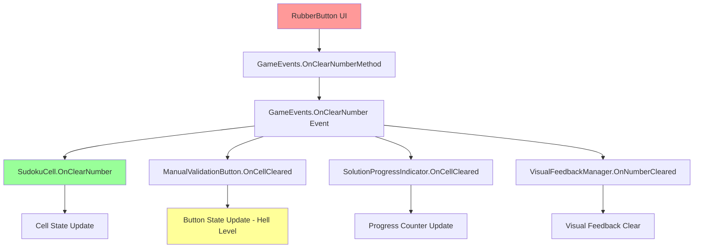
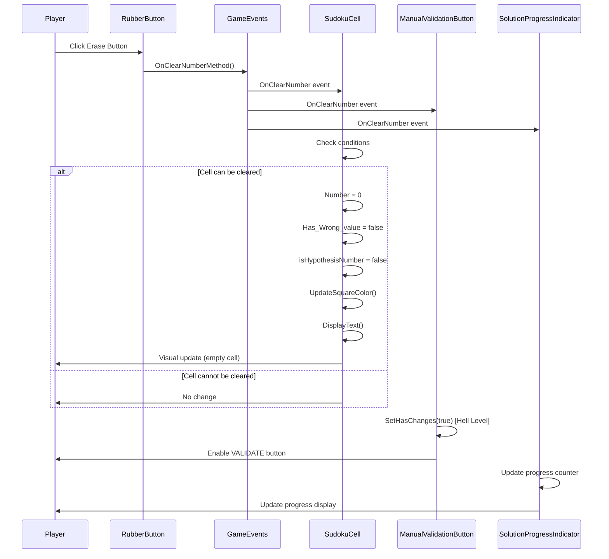
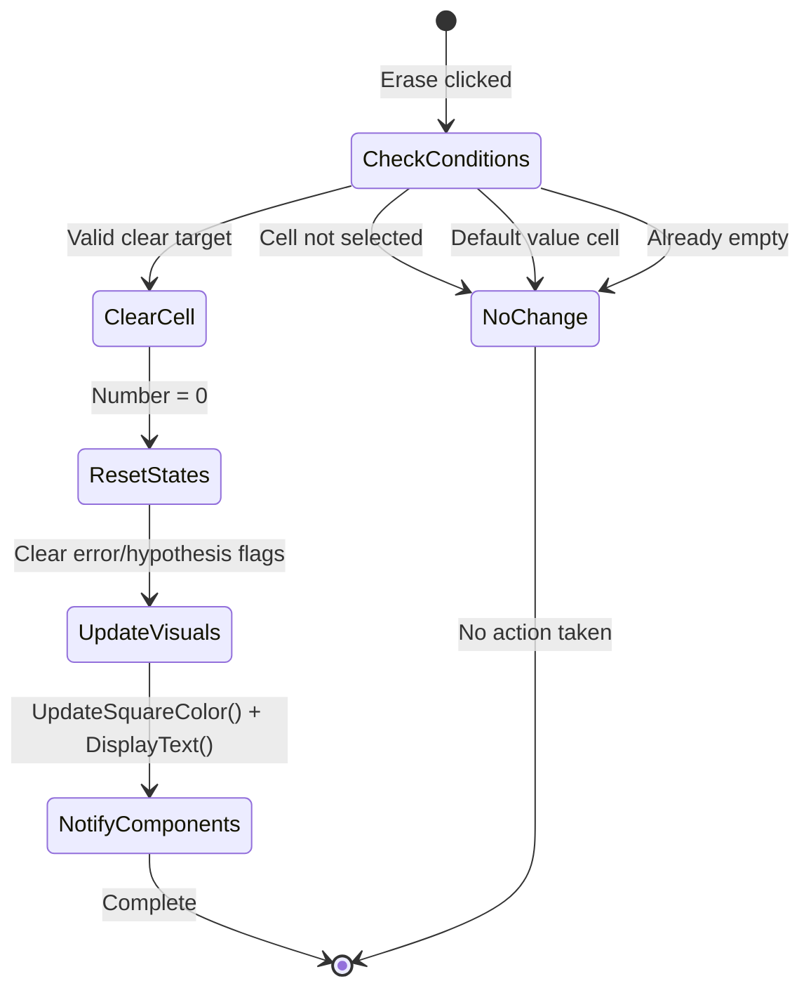

# Erase Feature Documentation - SudokuMaster

## Overview

The Erase feature in SudokuMaster allows players to clear numbers from selected cells. This feature works through a global event system and is implemented using the "Rubber Button" UI component. The system is designed to work across all difficulty levels, including Hell Level.

## Architecture Overview



## Component Breakdown

### 1. RubberButton (UI Component)

**File**: `Assets/Scripts/RubberButton.cs`

```csharp
public class RubberButton : Selectable, IPointerClickHandler
{
    public void OnPointerClick(PointerEventData eventData)
    {
        GameEvents.OnClearNumberMethod();
    }   
}
```

**Functionality**:
- Simple UI button that implements Unity's `IPointerClickHandler`
- When clicked, triggers the global clear number event
- No complex logic - acts as a pure event trigger

### 2. GameEvents (Event System)

**File**: `Assets/Scripts/GameEvents.cs`

```csharp
public delegate void ClearNumber();
public static event ClearNumber OnClearNumber;
public static void OnClearNumberMethod() => OnClearNumber?.Invoke();
```

**Functionality**:
- Defines the global clear number event
- Uses C# delegate pattern for event broadcasting
- Single method call triggers all subscribers simultaneously

### 3. SudokuCell (Primary Handler)

**File**: `Assets/Scripts/SudokuCell.cs`

```csharp
public void OnClearNumber()
{
    if (IsSelected && !Has_default_value && !IsCorrectNumberSet())
    {
        Number = 0;
        Has_Wrong_value = false;
        isHypothesisNumber = false; // Clear hypothesis state
        UpdateSquareColor();
        DisplayText();
    }
}
```

**Functionality**:
- **Condition Checks**:
  - `IsSelected`: Only clear the currently selected cell
  - `!Has_default_value`: Cannot erase pre-filled puzzle numbers
  - `!IsCorrectNumberSet()`: Prevents clearing correct numbers (safety check)

- **State Updates**:
  - `Number = 0`: Clears the cell value
  - `Has_Wrong_value = false`: Removes error state
  - `isHypothesisNumber = false`: Clears Hell Level hypothesis state
  - Updates visual appearance and text display

## Event Subscribers

### 1. ManualValidationButton (Hell Level Support)

```csharp
void OnCellCleared()
{
    if (isHellLevel)
    {
        SetHasChanges(true);
    }
}
```

**Purpose**: Enables the validation button when cells are cleared in Hell Level mode.

### 2. SolutionProgressIndicator

**Purpose**: Updates the progress counter when cells are cleared.

### 3. VisualFeedbackManager

**Purpose**: Provides visual feedback and clears any error highlighting.

## Feature Flow Diagram



## Behavior Rules

### Cell Clearing Conditions

| Condition | Can Clear? | Reason |
|-----------|------------|--------|
| Empty cell selected | ❌ No | Nothing to clear |
| Default value cell selected | ❌ No | Cannot modify puzzle clues |
| User-entered number selected | ✅ Yes | User can clear their input |
| Correct number selected | ❌ No | Safety to prevent accidental clearing |
| Wrong number selected | ✅ Yes | Allow correction |
| Hypothesis number selected (Hell Level) | ✅ Yes | Allow clearing hypothesis |

### State Changes on Clear



## Hell Level Integration

### Hypothesis Number Clearing

In Hell Level, when a hypothesis number is cleared:

1. **Cell State Reset**:
   ```csharp
   Number = 0;
   Has_Wrong_value = false;
   isHypothesisNumber = false; // Critical for Hell Level
   ```

2. **Visual Update**: Cell returns to empty state with default styling

3. **Validation Button Update**: ManualValidationButton enables (hasChanges = true)

4. **No Immediate Validation**: Unlike normal levels, Hell Level doesn't trigger immediate validation on clear

### Validation Context Impact

The current ValidationContext system doesn't explicitly handle clear operations - it relies on the traditional SudokuCell clearing mechanism, which works correctly for all game modes.

## UI Integration

### Button Placement
- Typically placed in the number input area
- Often represented with an eraser icon
- Should be easily accessible during gameplay

### Visual Feedback
- Button press should provide immediate visual feedback
- Cell clearing should be visually instant
- Progress indicators should update immediately

## Error Handling

### Edge Cases

1. **Multiple Rapid Clicks**: Event system handles rapid clicking gracefully
2. **No Cell Selected**: Clear operation ignored (safe)
3. **Invalid Cell Types**: Conditions prevent clearing protected cells
4. **Game Pause State**: Event system respects pause state

### Safety Mechanisms

1. **Default Value Protection**: `!Has_default_value` prevents clearing puzzle clues
2. **Selection Requirement**: `IsSelected` ensures only intended cell is cleared
3. **Correct Number Protection**: `!IsCorrectNumberSet()` prevents accidental clearing

## Performance Considerations

### Event Broadcasting
- Single event triggers multiple subscribers
- Lightweight operations in each subscriber
- No performance impact on typical gameplay

### Visual Updates
- Cell color/text updates are efficient
- No complex recalculations required
- Immediate visual response

## Testing Scenarios

### Basic Functionality
1. **Clear user-entered number** → Should clear successfully
2. **Try to clear default value** → Should be ignored
3. **Clear with no selection** → Should be ignored
4. **Clear empty cell** → Should be ignored

### Hell Level Specific
1. **Clear hypothesis number** → Should clear and enable validation button
2. **Clear after validation** → Should reset error states
3. **Clear and re-enter** → Should work seamlessly

### Integration Testing
1. **Progress tracking** → Counter should decrease
2. **Visual feedback** → Error highlights should clear
3. **Button states** → Validation button should update

## Future Enhancement Opportunities

1. **Undo/Redo Support**: Track cleared values for undo functionality
2. **Bulk Clear**: Clear multiple selected cells
3. **Smart Clear**: Clear all notes when clearing cell number
4. **Animation**: Add clearing animation for better UX
5. **Audio Feedback**: Sound effect for successful clear operations

## Debugging Tips

### Common Issues
1. **Clear not working**: Check cell selection state
2. **Protected cells clearing**: Verify condition logic
3. **Progress not updating**: Check event subscription
4. **Visual not updating**: Verify UpdateSquareColor() call

### Debug Logging
```csharp
public void OnClearNumber()
{
    Debug.Log($"Clear attempt on cell {Cell_index}: Selected={IsSelected}, Default={Has_default_value}, Correct={IsCorrectNumberSet()}");
    if (IsSelected && !Has_default_value && !IsCorrectNumberSet())
    {
        Debug.Log($"Clearing cell {Cell_index} with value {Number}");
        // Clear logic...
    }
}
```

---

*This documentation covers the complete Erase feature implementation in SudokuMaster. The system is designed to be simple, reliable, and compatible with all game modes including the advanced Hell Level feature.*