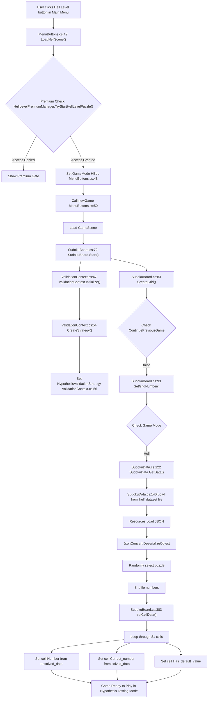

# SudokuMaster: Hell Level Initialization Data Flow Analysis

## 1. Overview

This document provides a comprehensive analysis of the data flow when a user selects the "Hell Level" difficulty and starts a new game. The analysis covers the entire process, from the initial UI interaction in the main menu to the final puzzle initialization, highlighting the unique validation strategy employed for this expert-level mode.

## 2. Mermaid Flowchart

## 3. Detailed Component Analysis

### 3.1. Difficulty Selection (`MenuButtons.cs`)

The process begins when the user clicks the "Hell Level" button in the main menu.

- **Lines 42-57**: The `LoadHellScene(string name)` method is invoked.
- **Premium Check**: The first action is to verify the user's subscription status via `HellLevelPremiumManager.Instance.TryStartHellLevelPuzzle()`. If the user does not have premium access and has used all free puzzles, the premium gate is shown, and the flow stops.
- **Set Game Mode**: If access is granted, `GameSettings.Instance.GameMode` is set to `EGameMode.HELL`.
- **New Game State**: The `newGame()` method is called to reset any previous game state, ensuring a fresh start.
- **Scene Load**: Finally, the main `GameScene` is loaded to begin puzzle setup.

### 3.2. Validation Strategy Initialization (`ValidationContext.cs`)

Once the `GameScene` loads, the `ValidationContext` plays a crucial role in setting up the unique Hell Level behavior.

- **Line 47**: The `Initialize(EGameMode gameMode)` method is called, receiving `EGameMode.HELL`.
- **Line 54**: Inside `CreateStrategy(EGameMode gameMode)`, the system evaluates the game mode.
- **Line 56**: The `switch` statement detects `EGameMode.HELL` and returns the `HypothesisValidationStrategy`. This is the key architectural decision that differentiates Hell Level from all other modes, enabling hypothesis-testing without immediate feedback as per the PRD.

### 3.3. Puzzle Loading Strategy (`SudokuBoard.cs` & `SudokuData.cs`)

With the game mode and validation strategy set, the `SudokuBoard` proceeds to load the puzzle data.

- **Line 93**: `SetGridNumber()` is called for a new game.
- **Line 374**: The game mode is checked. Since it is not `EASY`, the flow proceeds to load data from a file using `SudokuData.GetData(level)`.
- **Line 140 (`SudokuData.cs`):** The logic identifies the game mode as `"hell"` and sets the data level to `1`. This indicates that Hell Level puzzles are sourced from a specific, pre-generated dataset.
- **File Loading**: The system constructs a path like `"Dataset/hell/1-hell.txt"` and loads the corresponding JSON file from the `Resources` folder.
- **Deserialization**: The JSON data, containing the unsolved and solved puzzle states, is deserialized into a `SudokuBoardData` object.
- **Randomization**: A random puzzle is selected from the dataset, and its numbers are shuffled to provide variation.

### 3.4. Cell Population (`SudokuBoard.cs`)

This final setup stage is consistent with other game modes.

- **Line 383**: The `setCellData()` method is called to populate the visual grid.
- **Lines 388-409**: The code iterates through all 81 cells, setting the initial puzzle numbers (`unsolved_data`), the correct solution for later validation (`solved_data`), and marking which cells are part of the default puzzle (`Has_default_value`).

## 4. Conclusion

The Hell Level data flow successfully integrates a unique, strategy-based validation system while reusing the existing puzzle loading and board population logic. The flow begins with a premium access check, sets the game mode to `HELL`, and critically assigns the `HypothesisValidationStrategy` to the `ValidationContext`. The puzzle itself is loaded from a dedicated 'hell' dataset. This ensures that the player enters a game environment where immediate feedback is disabled, and manual validation is required, fulfilling the core requirements of the Hell Level feature.
