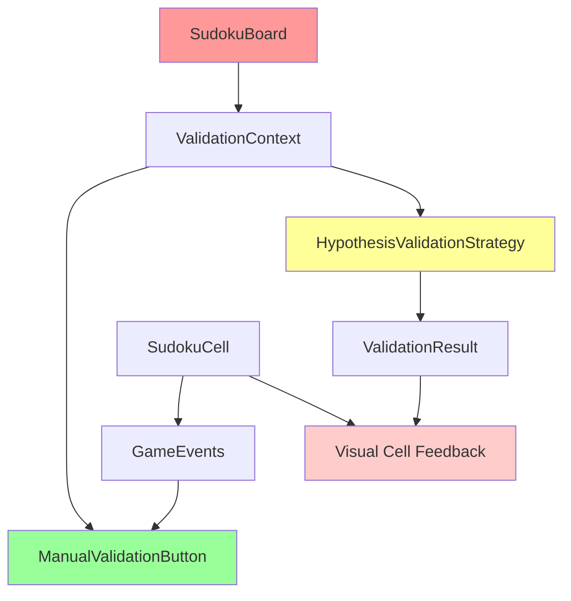
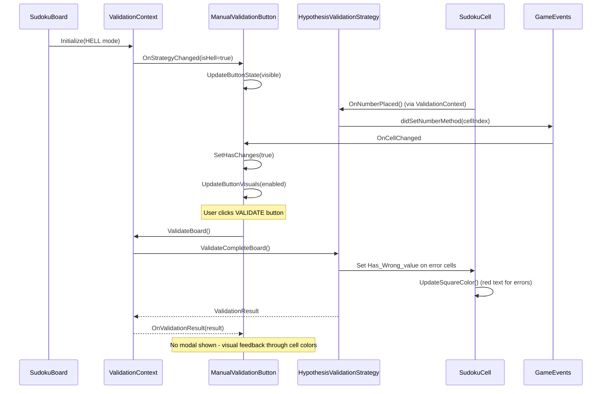
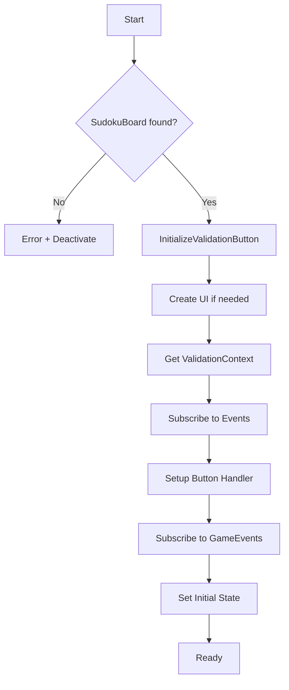
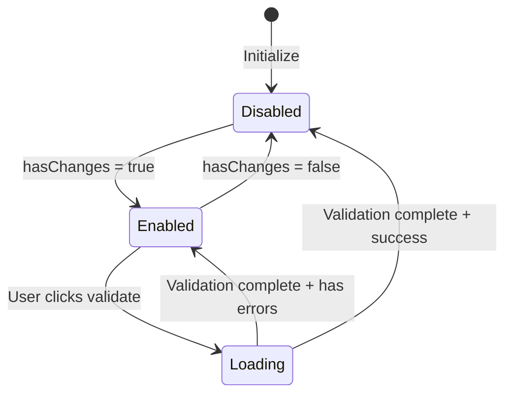
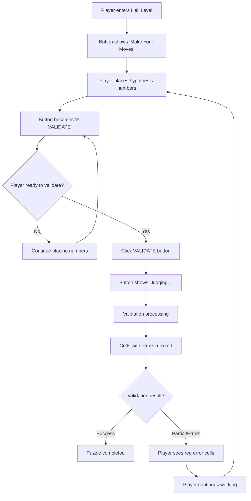
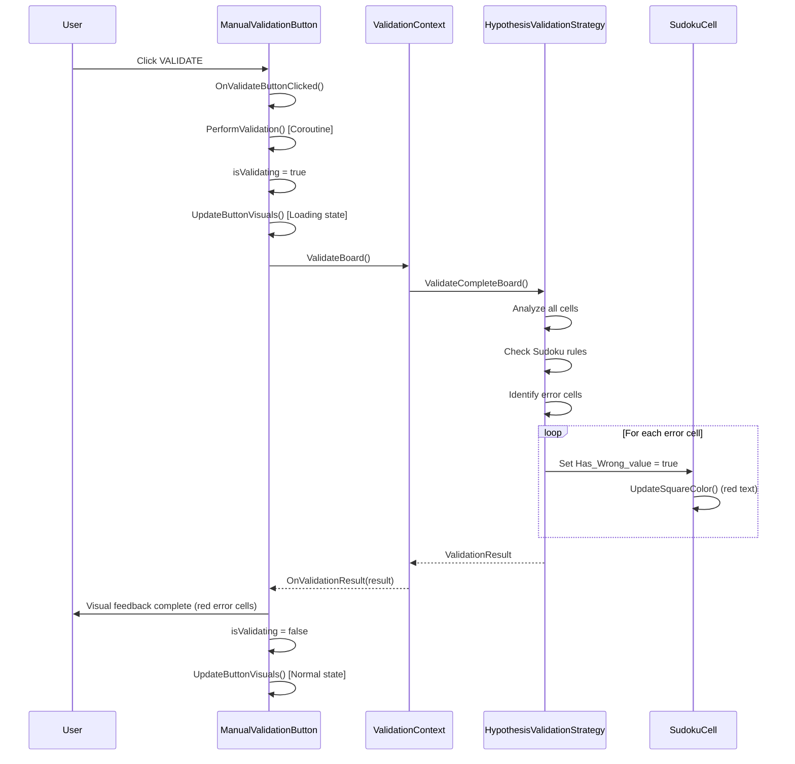
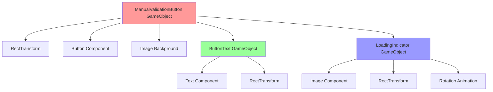
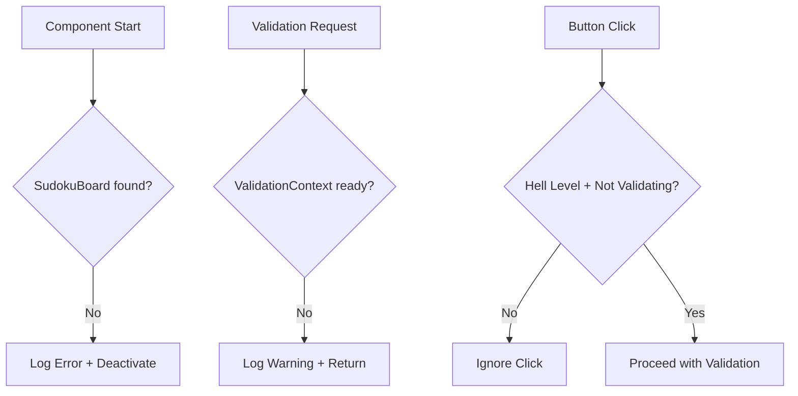
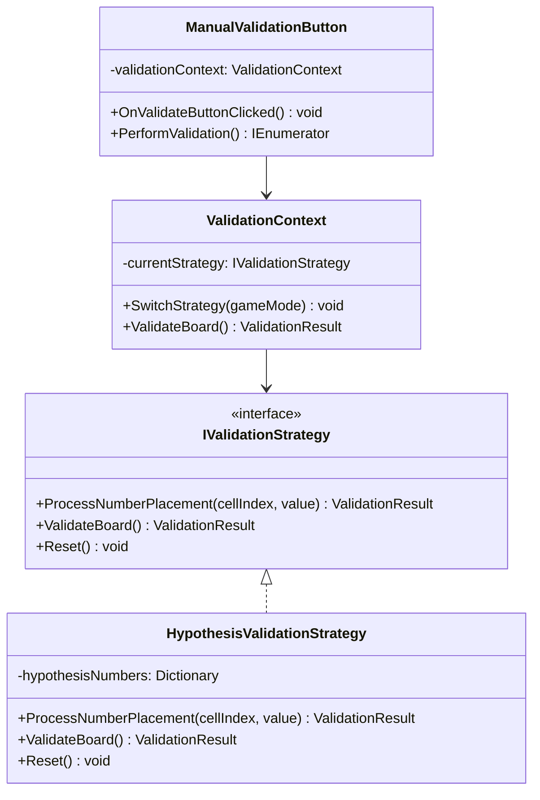

# ManualValidationButton Documentation

## Overview

The `ManualValidationButton` is a critical UI component in SudokuMaster's Hell Level mode that enables players to manually validate their hypothesis numbers. Unlike normal difficulty levels where validation happens immediately, Hell Level allows players to place multiple numbers as "hypotheses" and validate them all at once when ready.

**Key Changes (Latest Update)**:
- ✅ **Removed ValidationResultModal**: No more popup interruptions
- ✅ **Visual Cell Feedback**: Wrong numbers now display in red text
- ✅ **Streamlined UX**: Clean, non-intrusive validation experience

## Architecture Overview



## Core Components Integration

### 1. ValidationContext System
The ManualValidationButton integrates with the Strategy Pattern implementation:
- **ImmediateValidationStrategy**: Used for Easy/Medium/Hard/Extreme levels
- **HypothesisValidationStrategy**: Used exclusively for Hell Level with cell error state updates
- **ValidationContext**: Central manager that switches between strategies and filters deferred results

### 2. Event-Driven Architecture



## Component Lifecycle

### Initialization Flow



### Button State Management

The button has three distinct states:



## Button States Detailed

### 1. Disabled State
- **Text**: "Make Your Moves"
- **Color**: Gray (#404040)
- **Interactable**: false
- **Trigger**: No changes made to the board

### 2. Enabled State
- **Text**: "🔥 VALIDATE"
- **Color**: Orange (#E66600)
- **Interactable**: true
- **Trigger**: Player has made changes (hypothesis numbers placed)

### 3. Loading State
- **Text**: "Judging..."
- **Color**: Dark Orange (#CC4D00)
- **Interactable**: false
- **Features**: Rotating loading indicator
- **Duration**: 0.3 seconds + validation time

## Usage Flow

### Player Interaction Flow



### Technical Validation Flow



## UI Component Structure



## Layout and Positioning

### Button Layout Configuration
```csharp
// Anchor: Bottom center of parent
buttonRect.anchorMin = new Vector2(0.5f, 0f);
buttonRect.anchorMax = new Vector2(0.5f, 0f);
buttonRect.pivot = new Vector2(0.5f, 0f);
buttonRect.anchoredPosition = new Vector2(0, 150); // Above number buttons
buttonRect.sizeDelta = new Vector2(300, 55); // Width x Height
```

### Visual Hierarchy
1. **Position**: Bottom area, above number input buttons
2. **Size**: 300x55 pixels for optimal touch targets
3. **Colors**: Hell-themed orange/red palette
4. **Typography**: Bold, 20px font for emphasis

## Event System Integration

### Subscribed Events
```csharp
// ValidationContext events
validationContext.OnStrategyChanged += OnStrategyChanged;
validationContext.OnValidationResult += OnValidationResult;

// Game state events  
GameEvents.OnDidSetNumber += OnCellChanged;
GameEvents.OnClearNumber += OnCellCleared;

// Button interaction
validationButton.onClick.AddListener(OnValidateButtonClicked);
```

### Published Events
The button doesn't publish events directly but triggers validation through ValidationContext, which then publishes results.

## Performance Considerations

### Optimization Features
1. **UI Creation**: Programmatic UI generation only when needed
2. **State Updates**: Minimal visual updates only when state changes
3. **Coroutines**: Non-blocking validation with visual feedback
4. **Event Cleanup**: Proper unsubscription in OnDestroy()

### Memory Management
- Components created programmatically are properly cleaned up
- Coroutines are stopped when component is disabled
- Event listeners are removed on destruction

## Error Handling

### Graceful Degradation


### Error States
1. **Missing SudokuBoard**: Component deactivates itself
2. **Missing ValidationContext**: Validation requests are ignored
3. **Invalid Game Mode**: Button hides itself for non-Hell levels
4. **Concurrent Validation**: Subsequent clicks ignored during validation

## Integration with Validation System

### Strategy Pattern Integration


## Testing and Debug Features

### Editor-Only Debug Info
```csharp
#if UNITY_EDITOR
[Header("Debug Info (Editor Only)")]
[SerializeField] private bool debugIsHellLevel;
[SerializeField] private bool debugHasChanges;
[SerializeField] private bool debugIsValidating;
#endif
```

### Debug Logging
- Component initialization status
- Button state changes
- Validation requests and results
- Event subscription/unsubscription

## Best Practices for Usage

### For Developers
1. **Always check Hell Level mode** before showing the button
2. **Subscribe to ValidationContext events** for proper state management
3. **Handle edge cases** like missing components gracefully
4. **Use coroutines** for validation to maintain UI responsiveness

### For UI/UX Design
1. **Clear visual feedback** for all three button states
2. **Consistent Hell-themed styling** with orange/red palette
3. **Loading animations** to indicate processing
4. **Proper positioning** for easy thumb access on mobile

## Visual Feedback System (Latest Update)

### Cell Color-Based Validation

The ManualValidationButton now uses a **visual cell feedback system** instead of modal popups:

#### How It Works:
1. **User places hypothesis numbers** → Orange text (`Hypothesis_Text_Color`)
2. **User clicks VALIDATE** → Button shows "Judging..." 
3. **Validation processes silently** → No modal interruption
4. **Error cells turn red** → `Has_Wrong_value = true` triggers `Wrong_Color` text
5. **User continues working** → Clean, non-intrusive experience

#### Visual States:
- **🟠 Hypothesis Numbers**: Orange text (`#BC A428` color)
- **🔴 Error Numbers**: Red text (`Color.red`)  
- **🔵 Correct Numbers**: Blue text (`Correct_Color`)
- **⬜ Empty Cells**: Default state

#### Technical Implementation:
```csharp
// In HypothesisValidationStrategy.ValidateCompleteBoard()
private void UpdateCellErrorStates(List<SudokuCell> allCells, List<int> errorCells)
{
    // Reset all cells
    for (int i = 0; i < allCells.Count; i++)
    {
        if (!allCells[i].Has_default_value)
            allCells[i].Has_Wrong_value = false;
    }

    // Set error state for problem cells
    foreach (int errorIndex in errorCells)
    {
        if (errorIndex >= 0 && errorIndex < allCells.Count)
        {
            var cell = allCells[errorIndex];
            if (!cell.Has_default_value)
            {
                cell.Has_Wrong_value = true;
                cell.UpdateSquareColor(); // Immediate visual update
            }
        }
    }
}
```

#### Benefits:
- ✅ **Non-intrusive**: No modal popups to dismiss
- ✅ **Immediate**: Visual feedback is instant
- ✅ **Clear**: Red text clearly indicates errors
- ✅ **Contextual**: Errors shown directly on problem cells
- ✅ **Continuous**: Players can keep working without interruption

## Common Issues and Solutions

### Issue: Button not appearing
**Solution**: Ensure game mode is set to HELL and ValidationContext is properly initialized.

### Issue: Button always disabled
**Solution**: Check that HypothesisValidationStrategy.OnNumberPlaced() calls GameEvents.didSetNumberMethod() to trigger OnCellChanged.

### Issue: Validation not working
**Solution**: Verify ValidationContext has HypothesisValidationStrategy active and filters deferred results correctly.

### Issue: Memory leaks
**Solution**: Ensure proper cleanup in OnDestroy() - unsubscribe from all events and clean up button listeners.

## Future Enhancement Opportunities

1. **Haptic Feedback**: Add vibration on validation completion
2. **Sound Effects**: Audio cues for button state changes
3. **Keyboard Shortcuts**: Support for spacebar or enter key validation
4. **Accessibility**: Screen reader support and high contrast mode
5. **Analytics**: Track validation frequency and success rates

---

*This documentation covers the complete ManualValidationButton system as implemented in SudokuMaster's Hell Level feature, including the latest visual feedback improvements. The system now provides clean, non-intrusive validation through cell color changes rather than modal popups. For technical implementation details, refer to the source code at `Assets/Scripts/ManualValidationButton.cs`.*