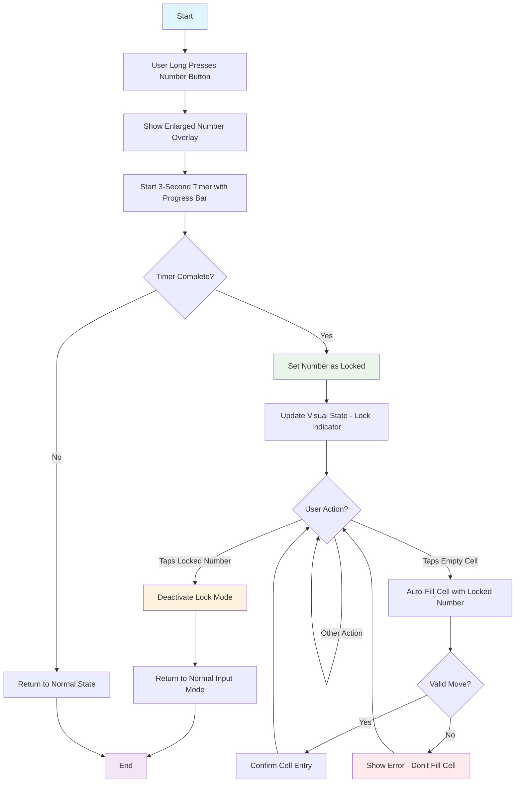

# Product Requirements Document (PRD): Number Lock Feature

## 1. Feature Overview

### 1.1 Feature Name
Number Lock/Pin Mode for Sudoku Input

### 1.2 Purpose
Enable users to lock a specific number for rapid sequential entry across multiple cells, improving gameplay efficiency for users who need to place the same number in multiple locations.

### 1.3 Target Users
- Intermediate to advanced Sudoku players
- Users who prefer strategic number placement patterns
- Players who want to optimize their solving workflow

## 2. Feature Requirements

### 2.1 Functional Requirements

#### 2.1.1 Number Lock Activation
- **Trigger**: Long press (tap and hold) on any number button (1-9) in the number input panel
- **Duration**: 3-second hold to activate lock
- **Visual Feedback**: 
  - Immediate overlay showing enlarged number during hold
  - Progress bar indicating hold duration (0-3 seconds)
  - Visual state change when lock is activated

#### 2.1.2 Locked State Behavior
- **Visual Indicator**: Locked number displays with distinct visual styling (highlighted background)
- **Input Mode**: Clicking any empty cell automatically enters the locked number
- **State Persistence**: Lock remains active until manually deactivated
- **Single Lock**: Only one number can be locked at a time

#### 2.1.3 Number Lock Deactivation
- **Trigger**: Single tap on the currently locked number
- **Effect**: Returns to normal input mode
- **Visual Update**: Removes lock visual indicators

### 2.2 Non-Functional Requirements

#### 2.2.1 Performance
- Smooth animations for lock activation/deactivation
- No input lag during locked mode operations
- Responsive touch feedback

#### 2.2.2 Usability
- Clear visual distinction between locked and unlocked states
- Intuitive gesture recognition (long press vs. tap)
- Consistent with existing UI design patterns

#### 2.2.3 Compatibility
- Works across all difficulty levels
- Maintains game save/load capabilities

## 3. User Experience Flow

### 3.1 Lock Activation Sequence
1. User identifies need to place same number multiple times
2. User long-presses desired number in input panel
3. System shows enlarged number overlay immediately
4. Progress bar appears and fills over 3 seconds
5. After 3 seconds, number enters locked state with visual confirmation
6. User can now tap empty cells to auto-fill with locked number

### 3.2 Lock Usage
1. User taps empty cells in sequence
2. Each tap automatically fills cell with locked number
3. Standard validation rules apply (no invalid moves)
4. User continues until all desired placements complete

### 3.3 Lock Deactivation
1. User taps the locked number once
2. System returns to normal input mode
3. Visual lock indicators disappear
4. Standard number selection behavior resumes

## 4. Technical Specifications

### 4.1 UI Components Required
- **Lock Overlay**: Enlarged number display during hold gesture
- **Progress Bar**: 3-second countdown indicator
- **Lock State Visual**: Background/border styling for locked numbers
- **Lock Icon**: Small indicator showing locked status

### 4.2 State Management
- **Lock State Variable**: Track which number (if any) is currently locked
- **Timer System**: 3-second countdown for lock activation
- **Input Mode Flag**: Toggle between normal and locked input modes

### 4.3 Integration Points
- **Number Panel**: Existing 1-9 input buttons need gesture detection
- **Cell Input**: Empty cell tap behavior modification when locked
- **Game State**: Lock status in save/load functionality
- **Validation**: Maintain existing Sudoku rule checking

## 5. Implementation Flowchart

## 6. Success Metrics

### 6.1 User Engagement
- Adoption rate of number lock feature
- Frequency of use per game session
- User retention with feature vs. without

### 6.2 Usability
- Success rate of lock activation attempts
- Average time to understand feature functionality
- User error rate during locked input mode

### 6.3 Performance
- Response time for lock activation
- Smooth animation performance across devices
- No impact on overall game performance

## 7. Future Considerations

### 7.1 Potential Enhancements
- Multiple number lock capability
- Customizable hold duration
- Audio feedback for lock activation
- Lock mode indicator in game HUD

### 7.2 Accessibility
- Voice-over compatibility for lock states
- High contrast mode support
- Alternative activation methods for motor accessibility