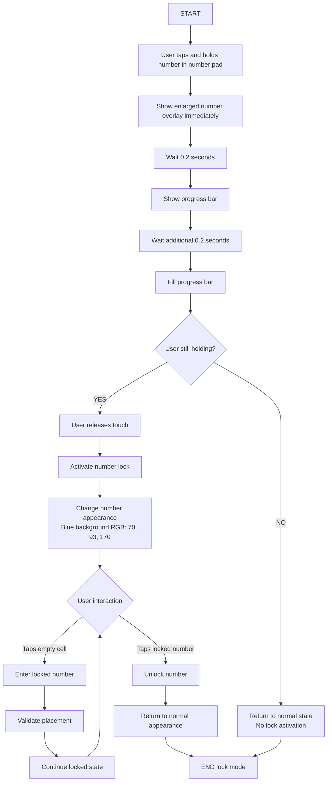

# Product Requirements Document (PRD): Number Lock Feature

## Overview
Enable users to lock a specific number for rapid sequential entry across multiple cells, improving gameplay efficiency for users who need to place the same number in multiple locations.

## Visual Reference
The following images demonstrate the Number Lock feature interaction flow:

- **Initial State**: `IMG_2472.jpg` - Shows the normal number pad in the red area where users can tap and hold
- **Lock Initiation**: `IMG_2473.PNG` - Shows enlarged number 5 overlay when tap-and-hold begins
- **Progress at 0.2s**: `IMG_2477.PNG` - Shows progress bar appearing above the enlarged number
- **Progress at 0.4s**: `IMG_2478.PNG` - Shows progress bar filled, indicating lock readiness
- **Locked State**: `IMG_2479.PNG` - Shows final locked state with blue background (RGB: 70, 93, 170)
- **Alternative Locked View**: `IMG_2465.PNG` - Shows another example of locked number with blue background

## Problem Statement
Players often need to enter the same number across multiple cells in a Sudoku puzzle. The current input method requires selecting the number from the number pad for each cell entry, which is inefficient and slows down gameplay flow.

## Solution
Implement a "Number Lock" feature that allows users to lock a specific number through a tap-and-hold gesture, enabling rapid sequential entry across multiple cells.

## User Stories
- As a Sudoku player, I want to lock a number so I can quickly fill multiple cells with the same value
- As a player, I want visual feedback during the lock process so I know when the feature is activated
- As a player, I want to easily unlock a number when I'm done using it

## Functional Requirements

### Core Functionality
1. **Number Lock Activation**
   - User performs tap-and-hold gesture on any number (1-9) in the number pad
   - Lock activation requires 0.4-second hold duration
   - Visual feedback provided throughout the hold process

2. **Visual Feedback System**
   - **Immediate Response (0.0s)**: Enlarged number overlay appears above the selected number (see `IMG_2473.PNG`)
   - **Progress Indicator (0.2s)**: Small progress bar appears on top of enlarged number (see `IMG_2477.PNG`)
   - **Progress Fill (0.4s)**: Progress bar fills completely, indicating lock readiness (see `IMG_2478.PNG`)
   - **Lock State**: Number background changes to blue (RGB: 70, 93, 170), white number text (see `IMG_2479.PNG` and `IMG_2465.PNG`)

3. **Locked Number Behavior**
   - Clicking any empty cell automatically enters the locked number
   - Locked state persists until manually unlocked
   - Only one number can be locked at a time

4. **Number Unlock**
   - Single tap on the currently locked number unlocks it
   - Number returns to normal appearance
   - Auto-entry behavior deactivates

### Technical Specifications
- **Hold Duration**: 0.4 seconds minimum for lock activation
- **Progress Bar Timing**: 
  - Appears at 0.2 seconds
  - Fills completely at 0.4 seconds
- **Lock Color**: RGB(70, 93, 170) background with white text
- **Overlay Scale**: Enlarged number should be visually prominent but not obstruct gameplay

## Non-Functional Requirements
- **Performance**: Lock activation should be responsive with no noticeable lag
- **Accessibility**: Visual feedback must be clear and easily distinguishable
- **Persistence**: Lock state maintained during game session but reset on game restart
- **Validation**: Locked number entry still subject to Sudoku validation rules

## User Experience Flow

### Lock Activation Sequence
1. User identifies need to enter same number multiple times
2. User taps and holds desired number in number pad
3. Enlarged number overlay appears immediately
4. Progress bar shows at 0.2 seconds
5. Progress bar fills by 0.4 seconds
6. User releases touch - number becomes locked (blue background)
7. User taps empty cells to auto-enter locked number
8. User taps locked number to unlock when finished

### Error Handling
- If user releases before 0.4 seconds: No lock activation, return to normal state
- If locked number violates Sudoku rules: Show normal validation error, maintain lock
- If all instances of locked number are placed: Keep lock active for potential corrections

## Success Metrics
- Reduced time for multi-cell number entry
- Improved user satisfaction for rapid number placement
- Minimal learning curve for existing users
- No increase in accidental number entries

## Implementation Flowchart

## Dependencies
- Existing number pad UI system
- Cell input validation system
- Touch input handling
- UI animation system
- Game state management

## Future Considerations
- Multi-number lock capability
- Lock state persistence across game sessions  
- Additional visual themes for locked numbers
- Audio feedback for lock activation
- Gesture alternatives for accessibility