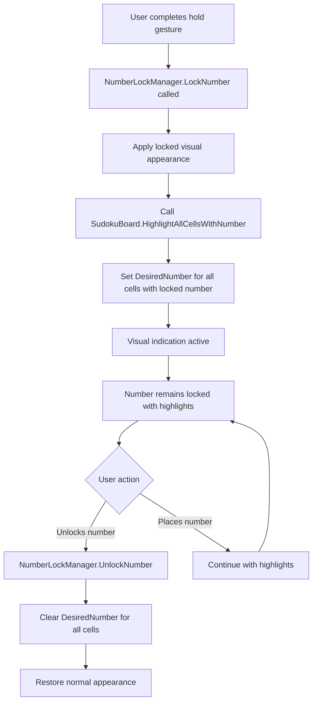
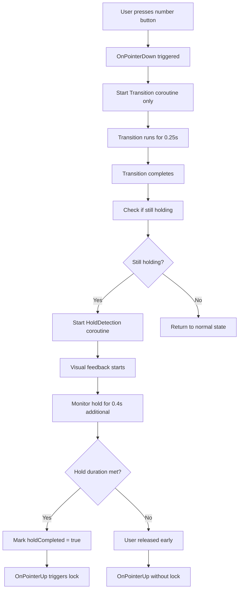
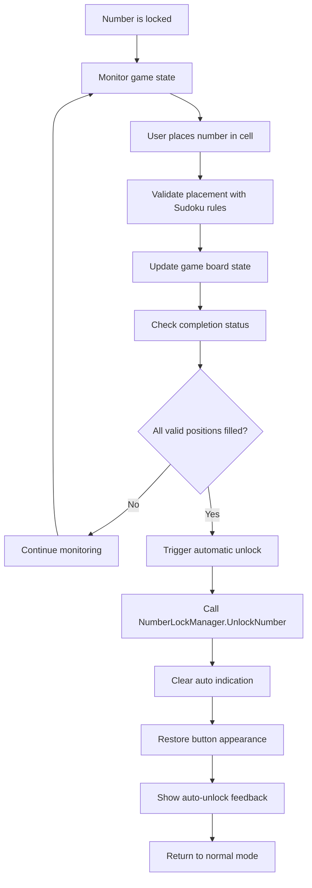
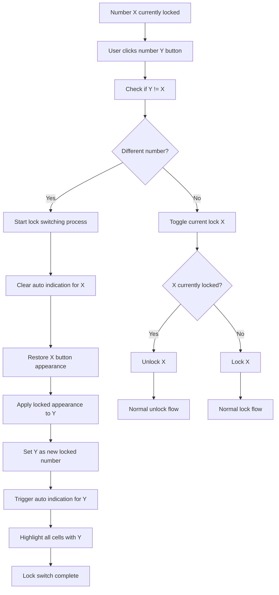

# Product Requirements Document (PRD): Number Lock Integration & Enhancement

## Executive Summary

This PRD addresses critical integration issues between the Number Lock feature and the existing Auto Indicate Related Cell feature in the Sudoku game. The enhancements will improve user experience by providing seamless visual feedback and intuitive number lock behavior.

## Current State Analysis

### Existing Auto Indicate Feature
- **Location**: `SudokuBoard.cs:436-437`
- **Functionality**: When user clicks a cell with a number, all cells with the same number are highlighted
- **Implementation**: Uses `LineIndicator.GetAllRelatedSudokuCell()` and `HighlightAllCellsWithNumber()`
- **Trigger**: `OnSquareSelected()` method when cell is clicked

### Current Number Lock System
- **Components**: `NumberLockManager.cs`, `NumberButton.cs`, `NumberLockVisualFeedback.cs`
- **Hold Duration**: 0.4 seconds
- **Visual State**: RGB(70, 93, 170) background when locked
- **Current Issues**: No integration with auto indicate, timing conflicts, no auto-unlock, no smart switching

## Problem Statement

Four critical issues prevent optimal user experience:

1. **Missing Auto Indication**: Number lock doesn't trigger highlight of existing numbers
2. **Coroutine Timing Conflict**: Transition and HoldDetection start simultaneously causing visual glitches
3. **No Automatic Unlock**: Numbers stay locked even when all instances are placed
4. **Poor Lock Switching**: No seamless transition when switching between locked numbers

## Requirements

### Issue 1: Auto Indicate on Number Lock

**Priority**: High
**User Story**: As a player, when I lock a number, I want to see all existing instances of that number highlighted so I can quickly identify where to place it next.

**Acceptance Criteria**:
- When `NumberLockManager.LockNumber()` is called, automatically trigger auto indication
- All cells containing the locked number should be highlighted using existing `HighlightAllCellsWithNumber()` method
- Indication persists while number remains locked
- Indication clears when number is unlocked
- Integration with existing `LineIndicator.GetAllRelatedSudokuCell()` system

### Issue 2: Sequential Coroutine Execution

**Priority**: High  
**User Story**: As a player, I want smooth visual feedback when pressing number buttons without glitches or conflicts.

**Acceptance Criteria**:
- `Transition()` coroutine completes fully (0.25s) before `HoldDetection()` starts
- Visual feedback remains smooth and consistent
- No interference between visual transition and hold detection
- Maintain current hold duration (0.4s) after transition completion

### Issue 3: Automatic Number Unlock

**Priority**: Medium
**User Story**: As a player, I want numbers to automatically unlock when I've placed all possible instances, so I don't need to manually unlock completed numbers.

**Acceptance Criteria**:
- Monitor game state for completion of locked number placement
- Automatically call `UnlockNumber()` when all valid cells for that number are filled
- Clear auto indication when auto-unlock occurs
- Provide subtle visual feedback indicating auto-unlock
- Validate using existing Sudoku rules engine

### Issue 4: Smart Lock Switching

**Priority**: High
**User Story**: As a player, when I click a different number while one is locked, I want it to smoothly switch to the new number with proper visual feedback.

**Acceptance Criteria**:
- Clicking different number while one is locked switches to new number
- Previous locked number returns to original appearance
- New number gets locked appearance (RGB: 70, 93, 170)
- Auto indication triggers for new locked number
- Smooth visual transition between lock states
- Single-click behavior for switching (no hold required)

## Detailed Flowcharts

### Issue 1 Flow: Auto Indicate Integration

### Issue 2 Flow: Sequential Coroutine Execution

### Issue 3 Flow: Automatic Unlock Detection

### Issue 4 Flow: Smart Lock Switching

## Technical Implementation Areas

### Modified Components

**NumberLockManager.cs**:
- Add method `TriggerAutoIndicationForLocked(int number)`
- Modify `LockNumber()` to call auto indication
- Modify `UnlockNumber()` to clear auto indication  
- Add `SwitchLockedNumber(int newNumber, NumberButton newButton)`
- Add integration with `SudokuBoard` for auto-unlock detection

**NumberButton.cs**:
- Modify `OnPointerDown()` to delay `HoldDetection` start
- Add `WaitForTransitionComplete()` coroutine
- Modify `OnPointerClick()` to handle smart switching
- Ensure proper cleanup of coroutine states

**SudokuBoard.cs**:
- Add method `CheckNumberCompletionStatus(int number)`
- Add integration point for auto-unlock triggers
- Modify existing auto indication to work with lock system
- Add number completion monitoring

### Integration Points

1. **Auto Indication Reuse**: Leverage existing `HighlightAllCellsWithNumber()` method
2. **Game State Monitoring**: Hook into existing number placement validation
3. **Visual Consistency**: Maintain current color scheme and transitions
4. **Event System**: Utilize existing `GameEvents` for coordination

## Success Metrics

- **Visual Feedback**: Smooth transitions with no visual glitches
- **User Experience**: Intuitive lock switching behavior
- **Performance**: No noticeable lag during state changes
- **Accuracy**: 100% reliable auto-unlock when appropriate
- **Integration**: Seamless coordination between lock and indication systems

## Testing Requirements

### Unit Tests
- Auto indication trigger on lock
- Sequential coroutine execution
- Auto-unlock detection logic
- Smart switching state management

### Integration Tests  
- Lock/unlock flow with auto indication
- Coroutine timing accuracy
- Complete number placement detection
- Multi-number switching scenarios

### UI Tests
- Visual state transitions
- Color scheme consistency
- Button appearance changes
- Highlight behavior accuracy

## Implementation Priority

1. **Phase 1**: Issue 2 (Sequential Coroutines) - Foundation fix
2. **Phase 2**: Issue 1 (Auto Indication Integration) - Core functionality
3. **Phase 3**: Issue 4 (Smart Lock Switching) - Enhanced UX
4. **Phase 4**: Issue 3 (Auto Unlock) - Polish feature

## Risk Mitigation

- **Performance**: Test with full board scenarios
- **Compatibility**: Ensure existing features remain functional  
- **Edge Cases**: Handle rapid clicking and state transitions
- **Visual Conflicts**: Prevent overlapping highlight states