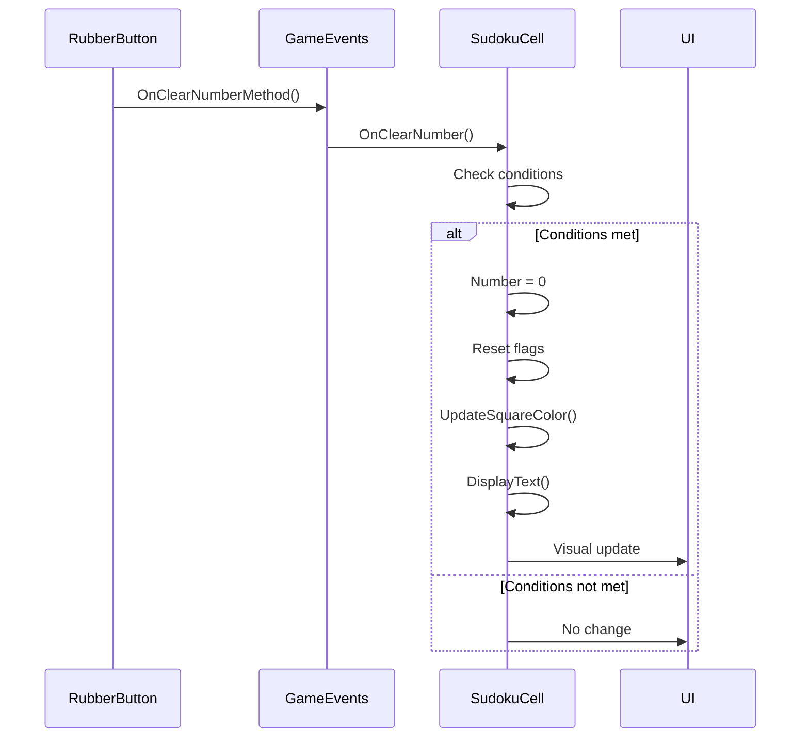
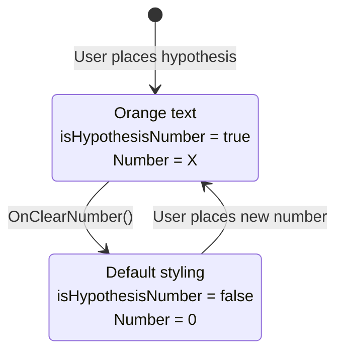

# OnClearNumber Method Documentation

## Method Overview

**File**: `Assets/Scripts/SudokuCell.cs`  
**Line**: 271-283  
**Purpose**: Handles the clearing of numbers from individual Sudoku cells when the erase button is pressed.

## Method Implementation

```csharp
public void OnClearNumber()
{
    if (IsSelected && !Has_default_value && !IsCorrectNumberSet())
    {
        Number = 0;
        Has_Wrong_value = false;
        isHypothesisNumber = false; // Clear hypothesis state
        //SetSquareColor(Color.white);
        UpdateSquareColor();
        //SetNoteNumberValue(0);
        DisplayText();
    }
}
```

## Method Breakdown

### Condition Checks

The method uses a compound conditional statement with three critical checks:

```csharp
if (IsSelected && !Has_default_value && !IsCorrectNumberSet())
```

| Condition | Type | Purpose |
|-----------|------|---------|
| `IsSelected` | `bool` | Ensures only the currently selected cell is cleared |
| `!Has_default_value` | `bool` | Prevents clearing pre-filled puzzle numbers |
| `!IsCorrectNumberSet()` | `bool` | Safety check - prevents clearing correct numbers |

### State Updates

When all conditions are met, the method performs these state changes:

#### 1. Clear Cell Value
```csharp
Number = 0;
```
- Resets the cell's numerical value to empty (0)
- This is the primary clearing operation

#### 2. Reset Error State  
```csharp
Has_Wrong_value = false;
```
- Removes the error flag that causes red text display
- Essential for visual feedback reset

#### 3. Clear Hypothesis State (Hell Level)
```csharp
isHypothesisNumber = false; // Clear hypothesis state
```
- Resets the Hell Level hypothesis flag
- Prevents orange text styling after clearing
- Critical for Hell Level mode functionality

#### 4. Update Visual Appearance
```csharp
UpdateSquareColor();
```
- Triggers visual refresh of the cell
- Updates background color, text color, and styling
- Reflects the new empty state visually

#### 5. Update Text Display
```csharp
DisplayText();
```
- Refreshes the cell's text display
- Shows empty state (blank text)
- Activates notes panel if applicable

## Event Integration

### Event Subscription
The method is automatically called via the GameEvents system:

```csharp
// In OnEnable()
GameEvents.OnClearNumber += OnClearNumber;

// In OnDisable()  
GameEvents.OnClearNumber -= OnClearNumber;
```

### Event Trigger Chain


## Behavior Matrix

| Cell State | IsSelected | Has_default_value | IsCorrectNumberSet() | Result |
|------------|------------|-------------------|---------------------|--------|
| Empty cell | ✅ Yes | ❌ No | ❌ No | No action (already empty) |
| User number | ✅ Yes | ❌ No | ❌ No | ✅ **CLEARED** |
| Wrong number | ✅ Yes | ❌ No | ❌ No | ✅ **CLEARED** |
| Correct number | ✅ Yes | ❌ No | ✅ **Yes** | No action (safety) |
| Default number | ✅ Yes | ✅ **Yes** | N/A | No action (protected) |
| Any cell | ❌ **No** | Any | Any | No action (not selected) |
| Hypothesis (Hell) | ✅ Yes | ❌ No | ❌ No | ✅ **CLEARED** |

## Hell Level Integration

### Hypothesis Number Clearing
In Hell Level mode, hypothesis numbers can be cleared:

```csharp
// Before clearing
isHypothesisNumber = true;   // Orange text
Number = 5;                  // Hypothesis value

// After OnClearNumber()
isHypothesisNumber = false;  // Reset hypothesis state
Number = 0;                  // Cleared value
Has_Wrong_value = false;     // Reset error state
```

### Visual State Transitions


## Related Methods

### UpdateSquareColor()
Called by OnClearNumber() to refresh visual appearance:
- Updates background colors based on cell state
- Sets text color (orange for hypothesis, red for wrong, blue for correct)
- Handles selection highlighting

### DisplayText()  
Called by OnClearNumber() to refresh text display:
- Shows number or empty space
- Activates/deactivates notes panel
- Updates text content

### IsCorrectNumberSet()
Used in condition check:
```csharp
public bool IsCorrectNumberSet() => Number == Correct_number;
```

## Error Handling

### Edge Cases
1. **Rapid clicking**: Method handles multiple rapid calls gracefully
2. **Invalid states**: Conditional checks prevent unintended clearing
3. **Visual inconsistencies**: UpdateSquareColor() ensures visual sync

### Safety Mechanisms
- **Default value protection**: Prevents clearing puzzle clues
- **Selection requirement**: Only affects intended cell
- **Correct number safety**: Prevents accidental loss of correct answers

## Performance Considerations

### Efficiency
- Lightweight conditional checks
- Minimal state updates  
- Efficient visual refresh

### Call Frequency
- Called once per erase button click
- Not called during gameplay unless explicitly triggered
- No performance impact during normal play

## Debugging

### Common Issues
1. **Cell won't clear**: Check if cell is selected and not a default value
2. **Visual not updating**: Verify UpdateSquareColor() and DisplayText() calls
3. **Wrong cells clearing**: Check IsSelected state

### Debug Logging
```csharp
public void OnClearNumber()
{
    Debug.Log($"Clear request for cell {Cell_index}: Selected={IsSelected}, Default={Has_default_value}, Correct={IsCorrectNumberSet()}");
    
    if (IsSelected && !Has_default_value && !IsCorrectNumberSet())
    {
        Debug.Log($"Clearing cell {Cell_index} - was {Number}, hypothesis={isHypothesisNumber}, wrong={Has_Wrong_value}");
        // ... clearing logic
    }
    else
    {
        Debug.Log($"Clear blocked for cell {Cell_index}");
    }
}
```

## Usage Examples

### Standard Clear Operation
```csharp
// User has selected a cell with wrong number 7
// Cell state: IsSelected=true, Has_default_value=false, Number=7, Has_Wrong_value=true

GameEvents.OnClearNumberMethod(); // Triggered by erase button

// Result: Number=0, Has_Wrong_value=false, cell displays empty
```

### Hell Level Hypothesis Clear
```csharp
// User has hypothesis number in Hell Level
// Cell state: IsSelected=true, isHypothesisNumber=true, Number=3

GameEvents.OnClearNumberMethod();

// Result: Number=0, isHypothesisNumber=false, Has_Wrong_value=false
// Visual: Orange text → Empty cell with default styling
```

---

*This documentation covers the complete OnClearNumber method implementation and its integration within the SudokuMaster erase system.*