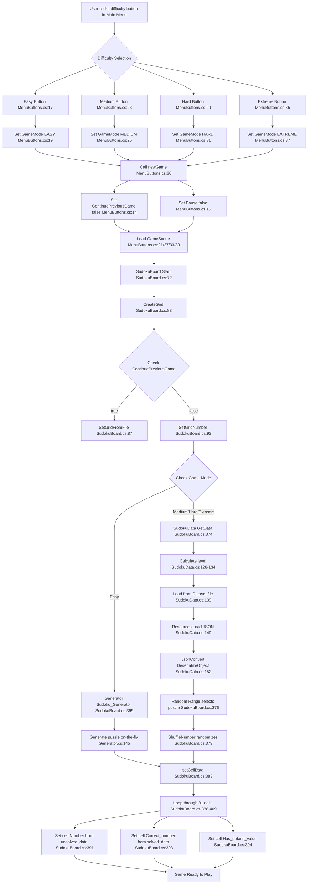

# SudokuMaster Game Level Selection and Initialization Data Flow Analysis

## Overview
This document analyzes the data flow when a user selects a difficulty level and starts a new game in the SudokuMaster Unity project. The analysis covers the complete process from UI interaction to puzzle initialization.

## Mermaid Flowchart



## Detailed Component Analysis

### 1. Difficulty Selection (MenuButtons.cs)
The main menu provides four difficulty buttons, each handled by specific methods:

- **Lines 17-22**: `LoadEasyScene(string name)`
  - Sets `GameSettings.Instance.GameMode = EGameMode.EASY`
  - Calls `newGame()` to reset game state
  - Loads the GameScene

- **Lines 23-28**: `LoadMediumScene(string name)`
  - Sets `GameSettings.Instance.GameMode = EGameMode.MEDIUM`
  - Follows same pattern as Easy

- **Lines 29-34**: `LoadHardScene(string name)`
  - Sets `GameSettings.Instance.GameMode = EGameMode.HARD`
  - Follows same pattern as Easy

- **Lines 35-40**: `LoadVeryHardScene(string name)`
  - Sets `GameSettings.Instance.GameMode = EGameMode.EXTREME`
  - Follows same pattern as Easy

### 2. Game State Management (GameSettings.cs)
Central singleton managing game state:

- **Line 20**: `EGameMode GameMode { get; set; }` - Stores selected difficulty
- **Line 21**: `bool ContinuePreviousGame { get; set; }` - Controls save/new game flow
- **Line 33**: `bool Pause { get; set; }` - Game pause state

### 3. Puzzle Loading Strategy

The game employs different strategies based on difficulty level:

#### Easy Mode (Dynamic Generation)
- **File**: `SudokuBoard.cs:363-371`
- **Process**: Uses real-time puzzle generation
- **Method**: `Generator.Sudoku_Generator(level)` from `Generator.cs:145`
- **Parameters**: Easy difficulty uses (35, 0) - 35 logical reductions, 0 random
- **Advantage**: Infinite unique puzzles, no storage required

#### Medium/Hard/Extreme (Pre-generated Dataset)
- **File**: `SudokuBoard.cs:374-381`
- **Process**: Loads from pre-computed puzzle files
- **Method**: `SudokuData.GetData(level)` from `SudokuData.cs:122`

**Level Selection Logic (SudokuData.cs:128-134):**
```csharp
int iLevel = (tmpStr) switch
{
    "medium" => Setting.Instance.MediumLevel,
    "hard" => Setting.Instance.HardLevel,        // Fixed: Now uses HardLevel
    "extreme" => Setting.Instance.ExtremeLevel,  // Fixed: Now uses ExtremeLevel
    _ => 0
};
```

**Level Grouping (SudokuData.cs:135-137):**
- Formula: `iLevel = ((int)((iLevel - 1) / 3)) + 1`
- Groups every 3 completed levels into next dataset file
- Caps at level 10: `if (iLevel > 10) iLevel = Random.Range(1, 11)`

### 4. Dataset Structure

**Location**: `Assets/Resources/Dataset/{difficulty}/`

**Files**: 
- `1-{difficulty}.txt` through `10-{difficulty}.txt`
- Each contains JSON array of puzzle objects

**File Format Example**:
```json
{
  "unsolved_data": [0,3,5,0,0,9,...],     // 81 integers, 0 = empty cell
  "solved_data": [4,3,5,2,6,9,...],       // 81 integers, complete solution
  "unsolvedCells": 43,                     // Count of empty cells
  "removeSingle": 81,                      // Generation parameter
  "cutoff": 10,                           // Difficulty parameter
  "difficulity": 2,                       // Difficulty rating
  "step": 44,                             // Solution steps
  "solvedTime": 0.0017,                   // Generation time
  "level": 700,                           // Internal level
  "methodCounters": [...]                 // Solving techniques used
}
```

### 5. Puzzle Loading Process (SudokuData.cs)

**File Path Construction (Line 139):**
```csharp
path = $"Dataset/{tmpStr}/{iLevel}-{tmpStr}";
```

**Resource Loading (Lines 149-152):**
1. `Resources.Load(path)` loads TextAsset
2. `mydata.text` extracts JSON string
3. `JsonConvert.DeserializeObject<List<SudokuData.SudokuBoardData>>(json)` parses data

### 6. Cell Population (SudokuBoard.cs:383-409)

The `setCellData()` method populates the game board:

- **Line 388-409**: Loops through all 81 cells
- **Line 391**: `cell.SetNumber(data.unsolved_data[i])` - Sets initial visible numbers
- **Line 393**: `cell.SetCorrectNumber(data.solved_data[i])` - Sets solution for validation
- **Line 394**: `cell.Has_default_value = data.unsolved_data[i] != 0` - Marks pre-filled cells
- **Lines 398-407**: Sets position metadata (row, column, block indices)

### 7. Number Shuffling (SudokuData.cs:66-75)

For non-Easy difficulties, numbers are shuffled to create visual variety:
- **Line 68**: `var numberShuffle = System.Linq.Enumerable.Range(1, 9).Shuffle()`
- **Lines 69-75**: Remaps all numbers 1-9 to shuffled equivalents

## Code Quality Assessment

### Bug Status: Fixed
**File**: `SudokuData.cs:131-132`
**Previous Issue**: Hard and Extreme difficulties were incorrectly using `Setting.Instance.MediumLevel`
**Current Status**: ✅ RESOLVED - Now correctly uses `HardLevel` and `ExtremeLevel` properties
**Impact**: Each difficulty now maintains independent progression tracking

### Architecture Strengths

1. **Separation of Concerns**: Clear division between UI, game state, and data loading
2. **Flexible Generation**: Dual approach allows dynamic vs. pre-computed puzzles
3. **Progress Tracking**: Player progression saved per difficulty
4. **Data Validation**: Complete solutions stored for validation
5. **Performance**: Pre-computed puzzles for complex difficulties

## File References

- **MenuButtons.cs**: UI difficulty selection (lines 17-40)
- **GameSettings.cs**: Central game state management (lines 20-33)
- **SudokuBoard.cs**: Game initialization and board setup (lines 72-409)
- **SudokuData.cs**: Data loading and management (lines 115-160)
- **Generator.cs**: Dynamic puzzle generation (line 145)
- **EGameMode.cs**: Difficulty enumeration (lines 7-14)
- **Dataset Directory**: `Assets/Resources/Dataset/{easy|medium|hard|extreme}/`

## Conclusion

The SudokuMaster game implements a sophisticated two-tier puzzle loading system that balances performance with variety. The architecture effectively separates concerns while maintaining data integrity through the complete game flow from menu selection to playable puzzle state.