# SudokuMaster: Complete Game Flow Analysis & Architecture Documentation

## Table of Contents
1. [Overview](#overview)
2. [System Architecture](#system-architecture)
3. [Data Persistence & State Management](#data-persistence)
4. [Normal Game Flow (Easy to Extreme Levels)](#normal-game-flow)
5. [Hell Level - Advanced Challenge System](#hell-level-chapter)
6. [Class Relationships & Dependencies](#class-relationships)
7. [Data Flow Analysis](#data-flow-analysis)
8. [Key Integration Points](#integration-points)

---

## Overview

SudokuMaster is a Unity-based Sudoku game featuring five difficulty levels with a unique Hell Level that implements advanced hypothesis testing and manual validation. The game uses a Strategy Pattern for validation and provides distinct user experiences across difficulty levels. This document provides a comprehensive analysis of the game's architecture, data flow, and state management for all game modes.

### Key Features
- **Five Difficulty Levels**: Easy, Medium, Hard, Extreme, Hell
- **Strategy Pattern Validation**: Immediate vs Hypothesis validation strategies
- **Hell Level Innovation**: Manual validation with graded feedback and a dedicated tutorial
- **Advanced UI Components**: Dynamic UI generation based on game mode
- **Performance Optimization**: Cell caching and batch processing for smooth gameplay
- **Data Persistence**: Saves and loads game progress automatically

---

## System Architecture

### Core Components Overview

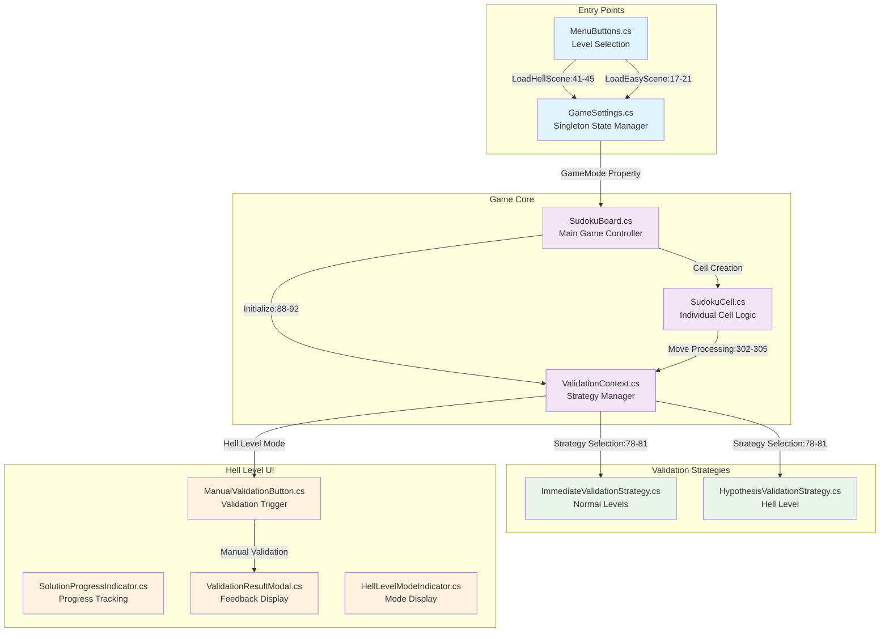
```mermaid
graph TB
    subgraph "Entry Points"
        MM[MenuButtons.cs<br/>Level Selection]
        GS[GameSettings.cs<br/>Singleton State Manager]
    end
    
    subgraph "Game Core"
        SB[SudokuBoard.cs<br/>Main Game Controller]
        SC[SudokuCell.cs<br/>Individual Cell Logic]
        VC[ValidationContext.cs<br/>Strategy Manager]
    end
    
    subgraph "Validation Strategies"
        IVS[ImmediateValidationStrategy.cs<br/>Normal Levels]
        HVS[HypothesisValidationStrategy.cs<br/>Hell Level]
    end
    
    subgraph "Hell Level UI"
        MVB[ManualValidationButton.cs<br/>Validation Trigger]
        SPI[SolutionProgressIndicator.cs<br/>Progress Tracking]
        VRM[ValidationResultModal.cs<br/>Feedback Display]
        HIM[HellLevelModeIndicator.cs<br/>Mode Display]
    end
    
    MM -->|LoadHellScene:41-45| GS
    MM -->|LoadEasyScene:17-21| GS
    GS -->|GameMode Property| SB
    SB -->|Initialize:88-92| VC
    VC -->|Strategy Selection:78-81| IVS
    VC -->|Strategy Selection:78-81| HVS
    SB -->|Cell Creation| SC
    SC -->|Move Processing:302-305| VC
    VC -->|Hell Level Mode| MVB
    MVB -->|Manual Validation| VRM
    
    classDef entryPoint fill:#e1f5fe
    classDef gameCore fill:#f3e5f5
    classDef strategy fill:#e8f5e8
    classDef hellUI fill:#fff3e0
    
    class MM,GS entryPoint
    class SB,SC,VC gameCore
    class IVS,HVS strategy
    class MVB,SPI,VRM,HIM hellUI
```

This architecture effectively decouples the game\'s core logic from its validation rules by using the Strategy Pattern (`ValidationContext`). The `GameSettings` singleton acts as a central state container, ensuring that the selected game mode persists across scene loads. This design allows for easy extension with new game modes or validation rules without modifying the core `SudokuBoard` controller.

#### **Diagram Line Explanations**
- **`MM -->|Load...Scene:17-45| GS`**: When a player selects a difficulty, `MenuButtons.cs` calls the appropriate method (e.g., `LoadHellScene`). These methods immediately update the `GameMode` property in the `GameSettings` singleton before loading the main game scene. This ensures the `SudokuBoard` initializes with the correct difficulty settings.
- **`SB -->|Initialize:88-92| VC`**: In its `Start` method, `SudokuBoard.cs` initializes the `ValidationContext`, passing it the current game mode. This is the critical step where the board delegates validation responsibility.
- **`VC -->|Strategy Selection:78-81| IVS/HVS`**: Inside `ValidationContext.cs`, the `SwitchStrategy` method uses a simple conditional check on the `GameMode` to instantiate either `ImmediateValidationStrategy` for normal levels or `HypothesisValidationStrategy` for Hell Level.
- **`SC -->|Move Processing:302-305| VC`**: When a player places a number in a `SudokuCell`, the cell doesn\'t validate the number itself. Instead, it calls `ValidationContext.ProcessMove`, passing its index and the new number. This centralizes all move processing.

### Game Mode Enumeration

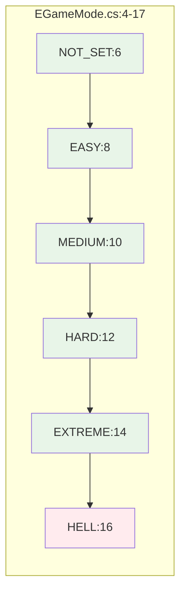
```mermaid
graph LR
    subgraph "EGameMode.cs:4-17"
        NS[NOT_SET:6]
        E[EASY:8]
        M[MEDIUM:10]
        H[HARD:12]
        EX[EXTREME:14]
        HELL[HELL:16]
    end
    
    NS --> E
    E --> M
    M --> H
    H --> EX
    EX --> HELL
    
    classDef normal fill:#e8f5e8
    classDef hell fill:#ffebee
    
    class NS,E,M,H,EX normal
    class HELL hell
```

*The game mode progression from NOT_SET through HELL level, with Hell Level highlighted as the advanced challenge mode.*

---

## Data Persistence & State Management

The game automatically saves progress, allowing players to continue a game later. This is handled by the `GameSettings` singleton, which likely uses Unity\'s `PlayerPrefs` to store game state data.

### Save/Load Data Flow


```mermaid
graph TD
    subgraph "Game Exit / Pause"
        A[Player Exits Scene] --> B{Is Game In Progress?}
        B -->|Yes| C[SudokuBoard triggers Save]
        C --> D[GameSettings collects state data]
        D --> E[Serialize board state, timer, lives]
        E --> F[PlayerPrefs.SetString#40;#34;SavedGame#34; , jsonData#41;]
        F --> G[PlayerPrefs.Save#40;#41;]
        B -->|No| H[Clear Saved Data]
    end
    
    subgraph "Game Start / Continue"
        I[Player Starts App] --> J[MenuButtons Check]
        J --> K{PlayerPrefs has #34;SavedGame#34;?}
        K -->|Yes| L[Enable #34;Continue#34; Button]
        L --> M[Player Clicks Continue]
        M --> N[GameSettings loads saved GameMode]
        N --> O[Load Game Scene]
        O --> P[SudokuBoard.Start checks GameSettings]
        P --> Q{ContinuePreviousGame == true?}
        Q -->|Yes| R[Deserialize board state]
        R --> S[Restore numbers, notes, timer, lives]
        S --> T[Gameplay Resumes]
        K -->|No| U[Disable #34;Continue#34; Button]
    end
```

This flow ensures that the player\'s progress is securely saved and seamlessly restored. The `GameSettings.ContinuePreviousGame` flag is a crucial part of this system, signaling to the `SudokuBoard` whether to generate a new puzzle or load the saved state upon initialization.

---

## Normal Game Flow

### Game State Flow Diagram


```mermaid
stateDiagram-v2
    [*] --> MainMenu
    
    MainMenu --> LevelSelection : User clicks difficulty
    LevelSelection --> GameSettings : MenuButtons sets GameMode
    
    state GameSettings {
        [*] --> SetMode
        SetMode --> SetContinueFlag : newGame() (12-16)
        SetContinueFlag --> [*] : ContinuePreviousGame = false
    }
    
    GameSettings --> GameScene : SceneManager.LoadScene
    
    state GameScene {
        [*] --> BoardInitialization
        BoardInitialization --> ValidationSetup : SudokuBoard Start line 75
        ValidationSetup --> CellCreation : CreateGrid()
        CellCreation --> ImmediateStrategy : InitializeValidationContext line 88
        ImmediateStrategy --> GameplayLoop
        
        state GameplayLoop {
            [*] --> WaitingForInput
            WaitingForInput --> CellSelected : OnPointerDown line 114
            CellSelected --> NumberPlacement : SetSquareNumber()
            NumberPlacement --> ImmediateValidation : ProcessMove line 302
            ImmediateValidation --> AudioFeedback : ShouldPlayAudio line 132
            AudioFeedback --> LifeSystem : ShouldUpdateLivesSystem line 131
            LifeSystem --> CompletionCheck
            CompletionCheck --> WaitingForInput : Continue
            CompletionCheck --> GameComplete : All cells correct
            CompletionCheck --> GameOver : Lives exhausted
        }
        
        GameComplete --> [*]
        GameOver --> [*]
    }
```

#### **Diagram State Explanations**
- **`newGame() (12-16)`**: This function in `MenuButtons.cs` is called when starting a new game. It critically sets `GameSettings.ContinuePreviousGame` to `false`, ensuring the `SudokuBoard` generates a fresh puzzle instead of loading a saved one.
- **`SudokuBoard.Start():75`**: This is the main entry point for the game scene. It orchestrates the entire setup process, from creating the grid to initializing the validation system.
- **`InitializeValidationContext():88`**: A helper method within `SudokuBoard` that creates and sets up the `ValidationContext`, passing the current `GameMode` to it.
- **`OnPointerDown():114`**: This Unity event handler in `SudokuCell.cs` detects a player\'s click, triggering the cell selection logic.
- **`ProcessMove():302`**: Triggered by `SetSquareNumber`, this is the call that passes the responsibility of validation from the `SudokuCell` to the `ValidationContext`.
- **`ShouldPlayAudio()/ShouldUpdateLivesSystem():131-132`**: These boolean methods are part of the `IValidationStrategy` interface. They allow the `ValidationContext` to query the current strategy (in this case, `ImmediateValidationStrategy`) to determine if game systems like audio and lives should be affected by a move, decoupling game rules from system feedback.

### Normal Level Cell Interaction Flow

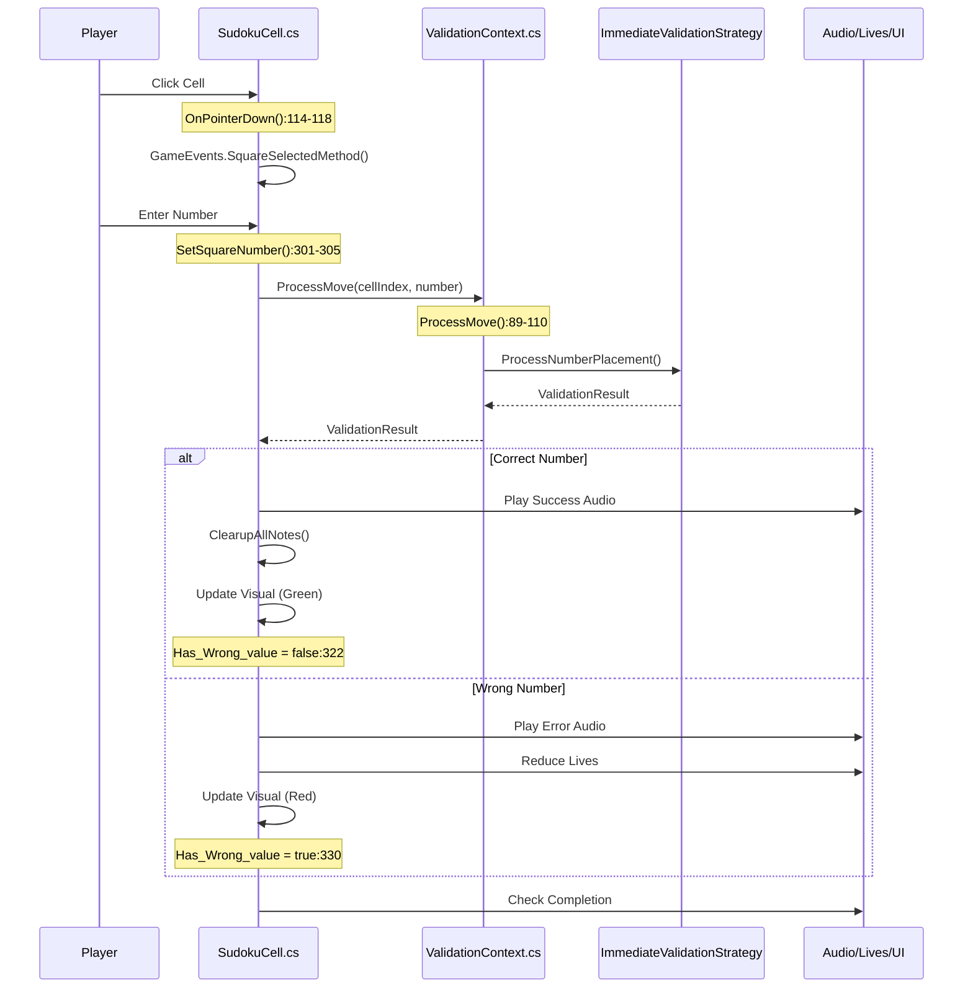
```mermaid
sequenceDiagram
    participant Player
    participant SudokuCell as SudokuCell.cs
    participant ValidationContext as ValidationContext.cs
    participant ImmediateStrategy as ImmediateValidationStrategy
    participant GameSystems as Audio/Lives/UI
    
    Player->>SudokuCell: Click Cell
    Note over SudokuCell: OnPointerDown():114-118
    SudokuCell->>SudokuCell: GameEvents.SquareSelectedMethod()
    
    Player->>SudokuCell: Enter Number
    Note over SudokuCell: SetSquareNumber():301-305
    SudokuCell->>ValidationContext: ProcessMove(cellIndex, number)
    Note over ValidationContext: ProcessMove():89-110
    ValidationContext->>ImmediateStrategy: ProcessNumberPlacement()
    
    ImmediateStrategy-->>ValidationContext: ValidationResult
    ValidationContext-->>SudokuCell: ValidationResult
    
    alt Correct Number
        SudokuCell->>GameSystems: Play Success Audio
        SudokuCell->>SudokuCell: ClearupAllNotes()
        SudokuCell->>SudokuCell: Update Visual (Green)
        Note over SudokuCell: Has_Wrong_value = false:322
    else Wrong Number
        SudokuCell->>GameSystems: Play Error Audio
        SudokuCell->>GameSystems: Reduce Lives
        SudokuCell->>SudokuCell: Update Visual (Red)
        Note over SudokuCell: Has_Wrong_value = true:330
    end
    
    SudokuCell->>GameSystems: Check Completion
```

#### **Diagram Line Explanations**
- **`SetSquareNumber():301-305`**: This method is the primary action handler in `SudokuCell.cs`. It takes the number input by the player and immediately forwards it to the `ValidationContext` for processing.
- **`ProcessMove():89-110`**: The `ValidationContext` receives the move, and without containing any logic itself, it delegates the request to its `currentStrategy`, which for normal levels is the `ImmediateValidationStrategy`.
- **`Has_Wrong_value = false:322,330`**: Based on the `ValidationResult` returned from the context, the `SudokuCell` updates its internal state. This boolean flag is likely used to control the cell\'s color (red for wrong, default/green for correct) and to quickly check for game completion.

### Immediate Validation Strategy Logic

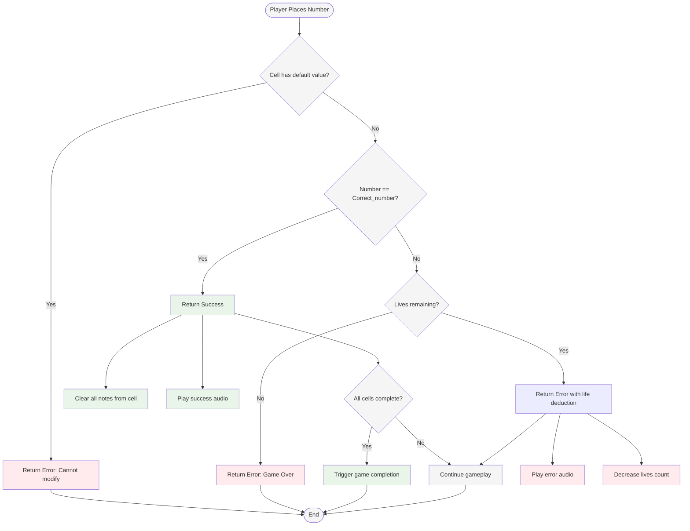
```mermaid
flowchart TD
    Start([Player Places Number])
    
    Start --> CheckDefault{Cell has default value?}
    CheckDefault -->|Yes| Error1[Return Error: Cannot modify]
    CheckDefault -->|No| CheckCorrect{Number == Correct_number?}
    
    CheckCorrect -->|Yes| Success[Return Success]
    CheckCorrect -->|No| CheckLives{Lives remaining?}
    
    CheckLives -->|Yes| Partial[Return Error with life deduction]
    CheckLives -->|No| GameOver[Return Error: Game Over]
    
    Success --> ClearNotes[Clear all notes from cell]
    Success --> PlaySuccess[Play success audio]
    Success --> CheckComplete{All cells complete?}
    CheckComplete -->|Yes| Victory[Trigger game completion]
    CheckComplete -->|No| Continue[Continue gameplay]
    
    Partial --> PlayError[Play error audio]
    Partial --> UpdateLives[Decrease lives count]
    Partial --> Continue
    
    Error1 --> End([End])
    GameOver --> End
    Victory --> End
    Continue --> End
    
    classDef successPath fill:#e8f5e8
    classDef errorPath fill:#ffebee
    classDef neutralPath fill:#f5f5f5
    
    class Success,ClearNotes,PlaySuccess,Victory successPath
    class Error1,GameOver,PlayError,UpdateLives errorPath
    class Start,CheckDefault,CheckCorrect,CheckLives,CheckComplete,Continue,End neutralPath
```

*This flowchart details the straightforward, real-time validation logic used in normal difficulty levels (Easy through Extreme).*

---

## Hell Level - Advanced Challenge System

### Hell Level Overview

Hell Level represents the pinnacle of Sudoku challenge in SudokuMaster, featuring:
- **Hypothesis Testing**: Players can place multiple numbers without immediate validation.
- **Manual Validation**: Players choose when to validate their progress.
- **Graded Feedback**: Comprehensive analysis of solution accuracy.
- **No Assistance**: Hints and Fast Notes are disabled.
- **Visual Distinction**: Orange styling for hypothesis numbers.
- **Guided Tutorial**: An interactive tutorial introduces the unique mechanics.

### Hell Level Initialization Flow

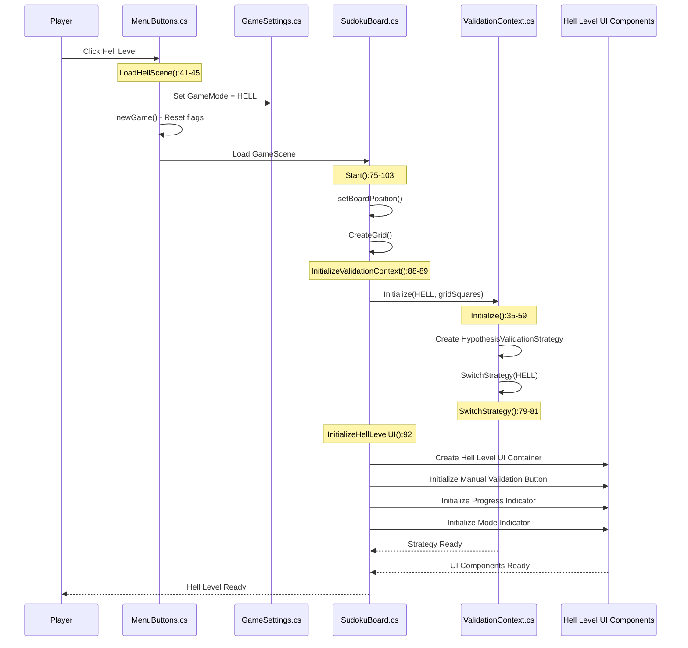
```mermaid
sequenceDiagram
    participant Player
    participant MenuButtons as MenuButtons.cs
    participant GameSettings as GameSettings.cs
    participant SudokuBoard as SudokuBoard.cs
    participant ValidationContext as ValidationContext.cs
    participant HellUI as Hell Level UI Components
    
    Player->>MenuButtons: Click Hell Level
    Note over MenuButtons: LoadHellScene():41-45
    MenuButtons->>GameSettings: Set GameMode = HELL
    MenuButtons->>MenuButtons: newGame() - Reset flags
    MenuButtons->>SudokuBoard: Load GameScene
    
    Note over SudokuBoard: Start():75-103
    SudokuBoard->>SudokuBoard: setBoardPosition()
    SudokuBoard->>SudokuBoard: CreateGrid()
    
    Note over SudokuBoard: InitializeValidationContext():88-89
    SudokuBoard->>ValidationContext: Initialize(HELL, gridSquares)
    Note over ValidationContext: Initialize():35-59
    ValidationContext->>ValidationContext: Create HypothesisValidationStrategy
    ValidationContext->>ValidationContext: SwitchStrategy(HELL)
    Note over ValidationContext: SwitchStrategy():79-81
    
    Note over SudokuBoard: InitializeHellLevelUI():92
    SudokuBoard->>HellUI: Create Hell Level UI Container
    SudokuBoard->>HellUI: Initialize Manual Validation Button
    SudokuBoard->>HellUI: Initialize Progress Indicator
    SudokuBoard->>HellUI: Initialize Mode Indicator
    
    ValidationContext-->>SudokuBoard: Strategy Ready
    HellUI-->>SudokuBoard: UI Components Ready
    SudokuBoard-->>Player: Hell Level Ready
```

#### **Diagram Line Explanations**
- **`Initialize():35-59`**: The `ValidationContext`\'s initialization method. It creates instances of *all* possible strategies and caches references to the game board and cells, preparing it for any game mode.
- **`SwitchStrategy():79-81`**: This is where the context actively selects the `HypothesisValidationStrategy` because the `GameMode` is `HELL`. It then invokes the `OnStrategyChanged` event to notify the UI.
- **`InitializeHellLevelUI():92`**: A dedicated method in `SudokuBoard` that runs only when the game mode is `HELL`. It instantiates the special UI prefabs (like the Validate button) required for this mode.

### Hell Level Tutorial Flow
For first-time Hell Level players, a short, interactive tutorial explains the unique mechanics.

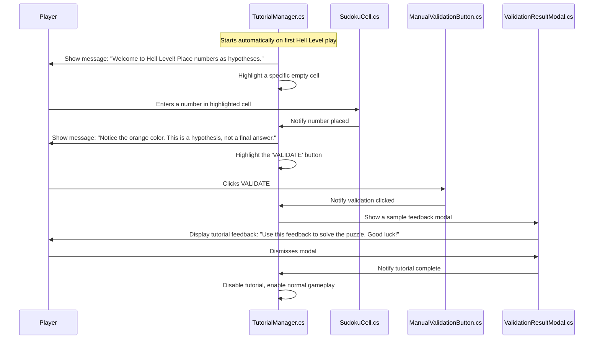
```mermaid
sequenceDiagram
    participant Player
    participant TutorialManager as TutorialManager.cs
    participant SudokuCell as SudokuCell.cs
    participant ManualValidationButton as ManualValidationButton.cs
    participant ValidationModal as ValidationResultModal.cs

    Note over TutorialManager: Starts automatically on first Hell Level play
    TutorialManager->>Player: Show message: "Welcome to Hell Level! Place numbers as hypotheses."
    TutorialManager->>TutorialManager: Highlight a specific empty cell
    
    Player->>SudokuCell: Enters a number in highlighted cell
    SudokuCell->>TutorialManager: Notify number placed
    TutorialManager->>Player: Show message: "Notice the orange color. This is a hypothesis, not a final answer."
    TutorialManager->>TutorialManager: Highlight the 'VALIDATE' button
    
    Player->>ManualValidationButton: Clicks VALIDATE
    ManualValidationButton->>TutorialManager: Notify validation clicked
    TutorialManager->>ValidationModal: Show a sample feedback modal
    ValidationModal->>Player: Display tutorial feedback: "Use this feedback to solve the puzzle. Good luck!"
    
    Player->>ValidationModal: Dismisses modal
    ValidationModal->>TutorialManager: Notify tutorial complete
    TutorialManager->>TutorialManager: Disable tutorial, enable normal gameplay
```
*This sequence ensures the player understands the core loop of hypothesis placement and manual validation before starting the challenge.*

### Hell Level Game State Flow

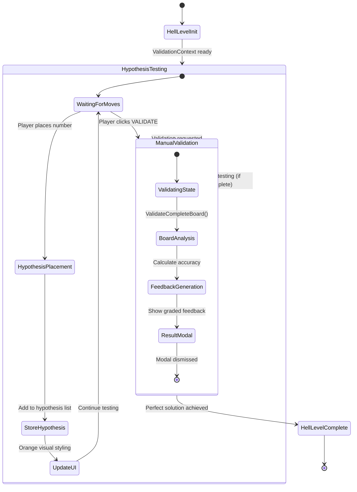
```mermaid
stateDiagram-v2
    [*] --> HellLevelInit
    
    HellLevelInit --> HypothesisTesting : ValidationContext ready
    
    state HypothesisTesting {
        [*] --> WaitingForMoves
        WaitingForMoves --> HypothesisPlacement : Player places number
        HypothesisPlacement --> StoreHypothesis : Add to hypothesis list
        StoreHypothesis --> UpdateUI : Orange visual styling
        UpdateUI --> WaitingForMoves : Continue testing
        WaitingForMoves --> ManualValidation : Player clicks VALIDATE
    }
    
    HypothesisTesting --> ManualValidation : Validation requested
    
    state ManualValidation {
        [*] --> ValidatingState
        ValidatingState --> BoardAnalysis : ValidateCompleteBoard()
        BoardAnalysis --> FeedbackGeneration : Calculate accuracy
        FeedbackGeneration --> ResultModal : Show graded feedback
        ResultModal --> [*] : Modal dismissed
    }
    
    ManualValidation --> HypothesisTesting : Continue testing (if incomplete)
    ManualValidation --> HellLevelComplete : Perfect solution achieved
    
    HellLevelComplete --> [*]
```

*Hell Level introduces a unique two-phase gameplay: hypothesis testing followed by manual validation.*

### Hypothesis Validation Strategy Flow

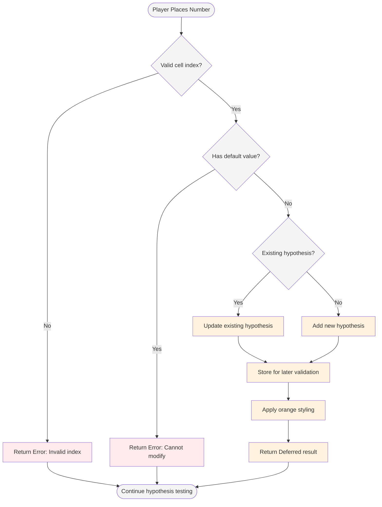
```mermaid
flowchart TD
    Start([Player Places Number])
    
    Start --> CheckIndex{Valid cell index?}
    CheckIndex -->|No| Error1[Return Error: Invalid index]
    CheckIndex -->|Yes| CheckDefault{Has default value?}
    
    CheckDefault -->|Yes| Error2[Return Error: Cannot modify]
    CheckDefault -->|No| CheckExisting{Existing hypothesis?}
    
    CheckExisting -->|Yes| UpdateHyp[Update existing hypothesis]
    CheckExisting -->|No| AddHyp[Add new hypothesis]
    
    UpdateHyp --> StoreDeferred[Store for later validation]
    AddHyp --> StoreDeferred
    
    StoreDeferred --> VisualFeedback[Apply orange styling]
    VisualFeedback --> DeferredResult[Return Deferred result]
    
    DeferredResult --> End([Continue hypothesis testing])
    Error1 --> End
    Error2 --> End
    
    classDef hypothesisPath fill:#fff3e0
    classDef errorPath fill:#ffebee
    classDef neutralPath fill:#f5f5f5
    
    class UpdateHyp,AddHyp,StoreDeferred,VisualFeedback,DeferredResult hypothesisPath
    class Error1,Error2 errorPath
    class Start,CheckIndex,CheckDefault,CheckExisting,End neutralPath
```

*The hypothesis validation strategy defers all validation until a manual trigger, allowing free experimentation. It simply records the player\'s move and returns a `Deferred` result.*

### Manual Validation Process

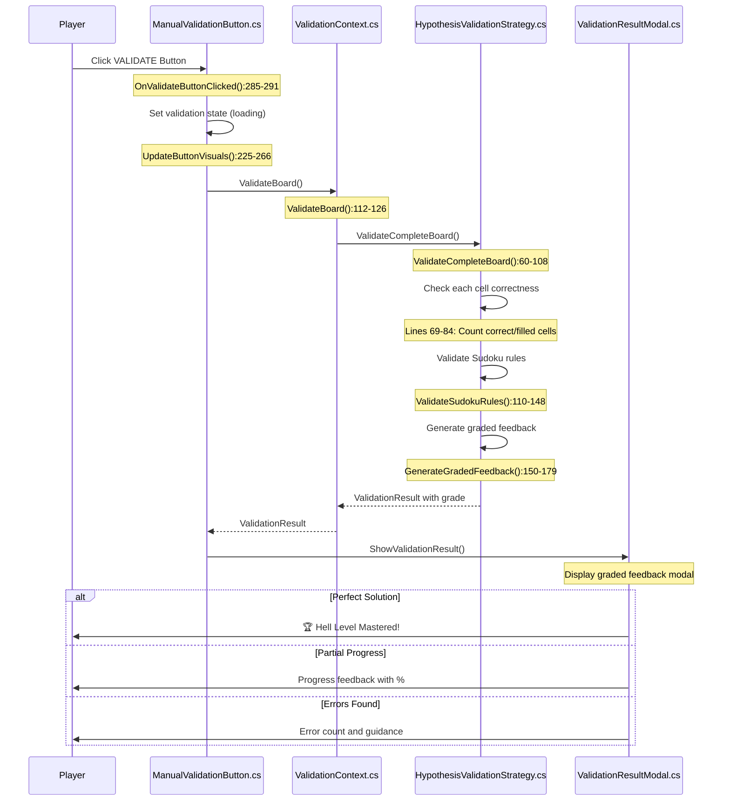
```mermaid
sequenceDiagram
    participant Player
    participant ManualValidationButton as ManualValidationButton.cs
    participant ValidationContext as ValidationContext.cs
    participant HypothesisStrategy as HypothesisValidationStrategy.cs
    participant ValidationModal as ValidationResultModal.cs
    
    Player->>ManualValidationButton: Click VALIDATE Button
    Note over ManualValidationButton: OnValidateButtonClicked():285-291
    ManualValidationButton->>ManualValidationButton: Set validation state (loading)
    Note over ManualValidationButton: UpdateButtonVisuals():225-266
    
    ManualValidationButton->>ValidationContext: ValidateBoard()
    Note over ValidationContext: ValidateBoard():112-126
    ValidationContext->>HypothesisStrategy: ValidateCompleteBoard()
    Note over HypothesisStrategy: ValidateCompleteBoard():60-108
    
    HypothesisStrategy->>HypothesisStrategy: Check each cell correctness
    Note over HypothesisStrategy: Lines 69-84: Count correct/filled cells
    HypothesisStrategy->>HypothesisStrategy: Validate Sudoku rules
    Note over HypothesisStrategy: ValidateSudokuRules():110-148
    HypothesisStrategy->>HypothesisStrategy: Generate graded feedback
    Note over HypothesisStrategy: GenerateGradedFeedback():150-179
    
    HypothesisStrategy-->>ValidationContext: ValidationResult with grade
    ValidationContext-->>ManualValidationButton: ValidationResult
    
    ManualValidationButton->>ValidationModal: ShowValidationResult()
    Note over ValidationModal: Display graded feedback modal
    
    alt Perfect Solution
        ValidationModal->>Player: 🏆 Hell Level Mastered!
    else Partial Progress
        ValidationModal->>Player: Progress feedback with %
    else Errors Found
        ValidationModal->>Player: Error count and guidance
    end
```

#### **Diagram Line Explanations**
- **`OnValidateButtonClicked():285-291`**: The UI entry point. This method in `ManualValidationButton.cs` initiates the entire validation sequence by calling the central `ValidationContext`.
- **`ValidateBoard():112-126`**: A public method on `ValidationContext` that allows external UI elements to trigger a full-board validation. It delegates the call to the current strategy.
- **`ValidateCompleteBoard():60-108`**: The core logic of Hell Level, located in `HypothesisValidationStrategy.cs`. This extensive method iterates through all player-placed numbers, compares them to the solution, checks for rule violations, and compiles the results.
- **`GenerateGradedFeedback():150-179`**: After analyzing the board, this helper method constructs the detailed `ValidationResult` object, including the feedback message, completion percentage, and a list of error cells.

### Hell Level UI Component Architecture

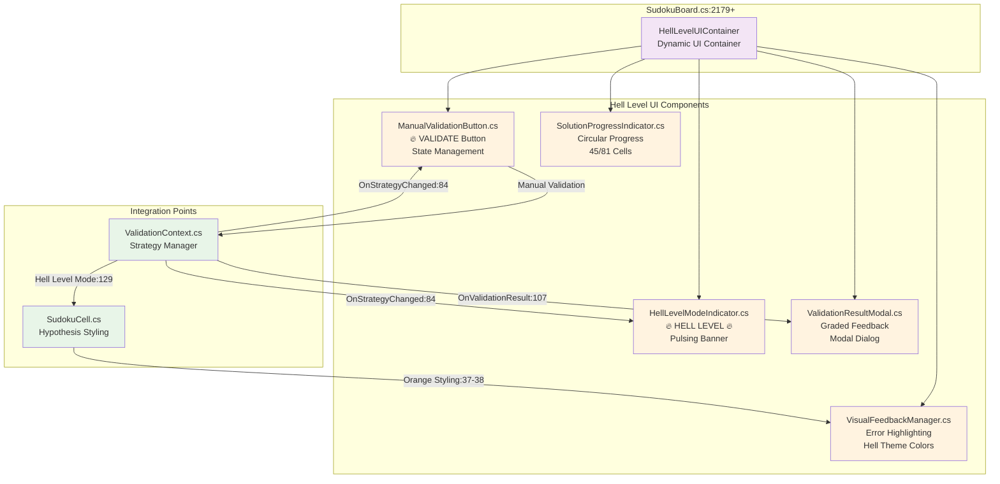
```mermaid
graph TB
    subgraph "SudokuBoard.cs:2179+"
        HLUI[HellLevelUIContainer<br/>Dynamic UI Container]
    end
    
    subgraph "Hell Level UI Components"
        HMI[HellLevelModeIndicator.cs<br/>🔥 HELL LEVEL 🔥<br/>Pulsing Banner]
        MVB[ManualValidationButton.cs<br/>🔥 VALIDATE Button<br/>State Management]
        SPI[SolutionProgressIndicator.cs<br/>Circular Progress<br/>45/81 Cells]
        VRM[ValidationResultModal.cs<br/>Graded Feedback<br/>Modal Dialog]
        VFM[VisualFeedbackManager.cs<br/>Error Highlighting<br/>Hell Theme Colors]
    end
    
    subgraph "Integration Points"
        VC[ValidationContext.cs<br/>Strategy Manager]
        SC[SudokuCell.cs<br/>Hypothesis Styling]
    end
    
    HLUI --> HMI
    HLUI --> MVB
    HLUI --> SPI
    HLUI --> VRM
    HLUI --> VFM
    
    VC -->|OnStrategyChanged:84| HMI
    VC -->|OnStrategyChanged:84| MVB
    VC -->|OnValidationResult:107| VRM
    VC -->|Hell Level Mode:129| SC
    
    SC -->|Orange Styling:37-38| VFM
    MVB -->|Manual Validation| VC
    
    classDef container fill:#f3e5f5
    classDef component fill:#fff3e0
    classDef integration fill:#e8f5e8
    
    class HLUI container
    class HMI,MVB,SPI,VRM,VFM component
    class VC,SC integration
```

#### **Diagram Line Explanations**
- **`OnStrategyChanged:84`**: This C# `Action` (event) is invoked by the `ValidationContext` whenever the strategy changes. UI components like `HellLevelModeIndicator` and `ManualValidationButton` subscribe to this event to automatically show or hide themselves, ensuring the UI always matches the game state.
- **`OnValidationResult:107`**: Another event from `ValidationContext`. After a manual validation, the context invokes this event, passing the detailed `ValidationResult`. The `ValidationResultModal` listens to this event to display the feedback to the player.

### Hell Level Cell Visual States

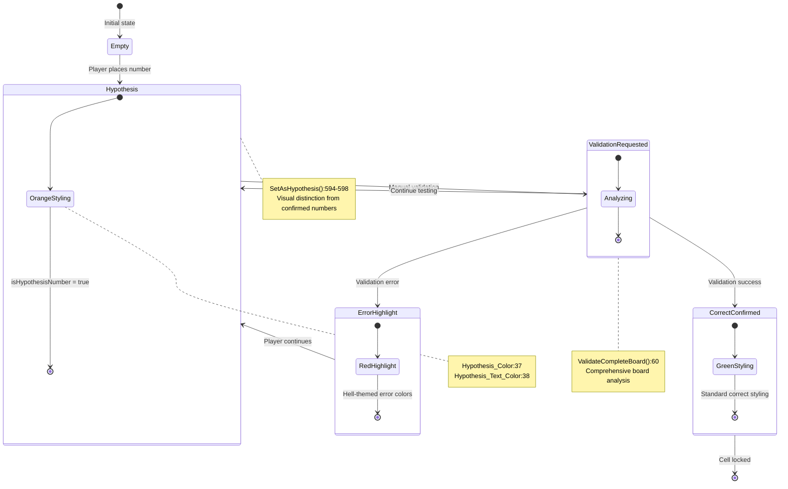
```mermaid
stateDiagram-v2
    [*] --> Empty : Initial state
    
    Empty --> Hypothesis : Player places number
    
    state Hypothesis {
        [*] --> OrangeStyling
        OrangeStyling --> [*] : isHypothesisNumber = true
        note right of OrangeStyling : Hypothesis_Color#58;37<br/>Hypothesis_Text_Color#58;38
    }
    
    Hypothesis --> ValidationRequested : Manual validation
    
    state ValidationRequested {
        [*] --> Analyzing
        Analyzing --> [*]
    }
    
    ValidationRequested --> CorrectConfirmed : Validation success
    ValidationRequested --> ErrorHighlight : Validation error
    ValidationRequested --> Hypothesis : Continue testing
    
    state CorrectConfirmed {
        [*] --> GreenStyling
        GreenStyling --> [*] : Standard correct styling
    }
    
    state ErrorHighlight {
        [*] --> RedHighlight
        RedHighlight --> [*] : Hell-themed error colors
    }
    
    CorrectConfirmed --> [*] : Cell locked
    ErrorHighlight --> Hypothesis : Player continues
    
    note right of Hypothesis : SetAsHypothesis()#58;594-598<br/>Visual distinction from confirmed numbers
    note right of ValidationRequested : ValidateCompleteBoard()#58;60<br/>Comprehensive board analysis
```

*Hell Level cells maintain a distinct hypothesis state (`isHypothesisNumber = true`) with unique visual feedback until validation confirms or rejects the placement.*

### Hell Level Graded Feedback System

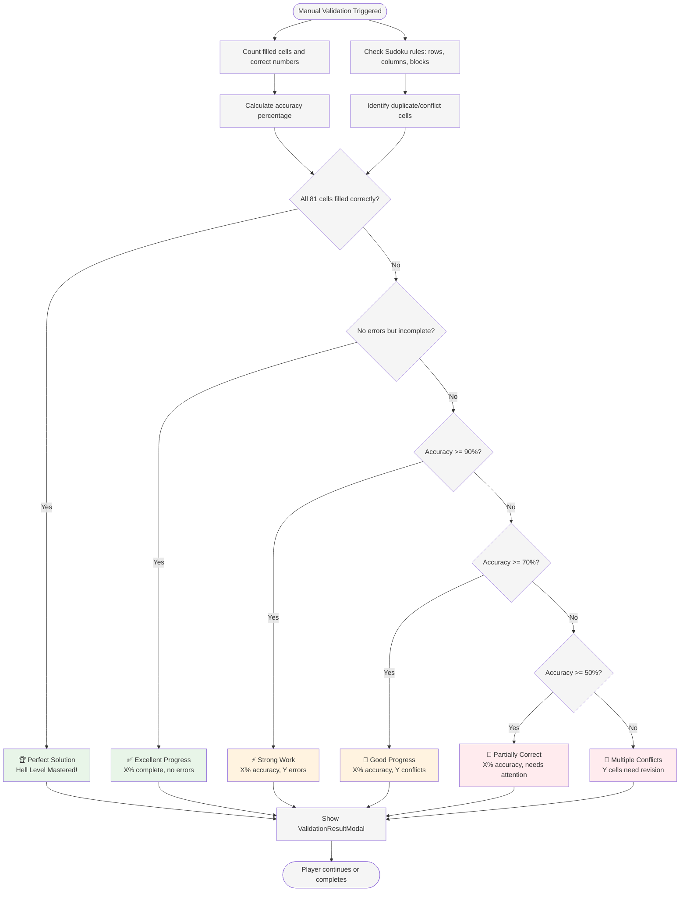
```mermaid
flowchart TD
    Start([Manual Validation Triggered])
    
    Start --> CountCells[Count filled cells and correct numbers]
    Start --> ValidateRules[Check Sudoku rules: rows, columns, blocks]
    
    CountCells --> CalcAccuracy[Calculate accuracy percentage]
    ValidateRules --> FindErrors[Identify duplicate/conflict cells]
    
    CalcAccuracy --> CheckCompletion{All 81 cells filled correctly?}
    FindErrors --> CheckCompletion
    
    CheckCompletion -->|Yes| Perfect[🏆 Perfect Solution<br/>Hell Level Mastered!]
    CheckCompletion -->|No| CheckNoErrors{No errors but incomplete?}
    
    CheckNoErrors -->|Yes| Progress[✅ Excellent Progress<br/>X% complete, no errors]
    CheckNoErrors -->|No| CheckAccuracy{Accuracy >= 90%?}
    
    CheckAccuracy -->|Yes| Strong[⚡ Strong Work<br/>X% accuracy, Y errors]
    CheckAccuracy -->|No| CheckGood{Accuracy >= 70%?}
    
    CheckGood -->|Yes| Good[💪 Good Progress<br/>X% accuracy, Y conflicts]
    CheckGood -->|No| CheckPartial{Accuracy >= 50%?}
    
    CheckPartial -->|Yes| Partial[🤔 Partially Correct<br/>X% accuracy, needs attention]
    CheckPartial -->|No| Multiple[🔄 Multiple Conflicts<br/>Y cells need revision]
    
    Perfect --> DisplayModal[Show ValidationResultModal]
    Progress --> DisplayModal
    Strong --> DisplayModal
    Good --> DisplayModal
    Partial --> DisplayModal
    Multiple --> DisplayModal
    
    DisplayModal --> End([Player continues or completes])
    
    classDef perfect fill:#e8f5e8
    classDef good fill:#fff3e0
    classDef needs fill:#ffebee
    classDef process fill:#f5f5f5
    
    class Perfect,Progress perfect
    class Strong,Good good
    class Partial,Multiple needs
    class Start,CountCells,ValidateRules,CalcAccuracy,FindErrors,CheckCompletion,CheckNoErrors,CheckAccuracy,CheckGood,CheckPartial,DisplayModal,End process
```

*The graded feedback system provides nuanced evaluation of Hell Level progress, encouraging continued experimentation rather than punishing single mistakes.*

### Hell Level Performance Optimizations

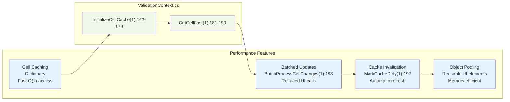
```mermaid
graph LR
    subgraph "Performance Features"
        CC[Cell Caching<br/>Dictionary<int, SudokuCell><br/>Fast O#40;1#41; access]
        BU[Batched Updates<br/>BatchProcessCellChanges#40;1#41;:198<br/>Reduced UI calls]
        OP[Object Pooling<br/>Reusable UI elements<br/>Memory efficient]
        CD[Cache Invalidation<br/>MarkCacheDirty#40;1#41;:192<br/>Automatic refresh]
    end
    
    subgraph "ValidationContext.cs"
        IC[InitializeCellCache#40;1#41;:162-179]
        GCF[GetCellFast#40;1#41;:181-190]
    end
    
    CC --> IC
    IC --> GCF
    GCF --> BU
    BU --> CD
    CD --> OP
    
    classDef optimization fill:#e3f2fd
    classDef implementation fill:#f1f8e9
    
    class CC,BU,OP,CD optimization
    class IC,GCF implementation
```

*Hell Level includes specific performance optimizations to handle complex validation scenarios efficiently. The cell cache (`Dictionary<int, SudokuCell>`) is particularly important, allowing the validation strategies to access cell components in O(1) time instead of iterating through a list.*

---

## Class Relationships & Dependencies

### Core Class Dependency Graph

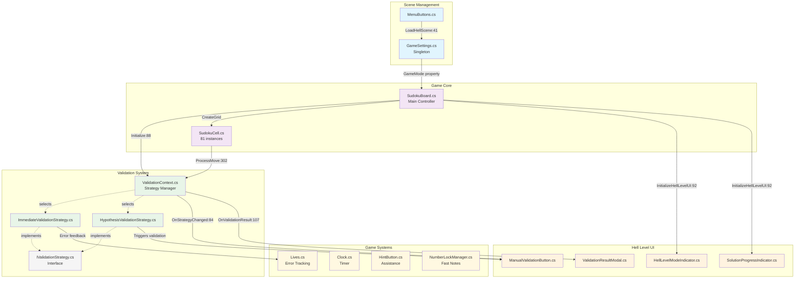
```mermaid
graph TD
    subgraph "Scene Management"
        MM[MenuButtons.cs]
        GS[GameSettings.cs<br/>Singleton]
    end
    
    subgraph "Game Core"
        SB[SudokuBoard.cs<br/>Main Controller]
        SC[SudokuCell.cs<br/>81 instances]
    end
    
    subgraph "Validation System"
        VC[ValidationContext.cs<br/>Strategy Manager]
        IVS[ImmediateValidationStrategy.cs]
        HVS[HypothesisValidationStrategy.cs]
        IVSI[IValidationStrategy.cs<br/>Interface]
    end
    
    subgraph "Game Systems"
        Lives[Lives.cs<br/>Error Tracking]
        Clock[Clock.cs<br/>Timer]
        Hints[HintButton.cs<br/>Assistance]
        NLM[NumberLockManager.cs<br/>Fast Notes]
    end
    
    subgraph "Hell Level UI"
        MVB[ManualValidationButton.cs]
        VRM[ValidationResultModal.cs]
        HMI[HellLevelModeIndicator.cs]
        SPI[SolutionProgressIndicator.cs]
    end
    
    MM -->|LoadHellScene:41| GS
    GS -->|GameMode property| SB
    SB -->|Initialize:88| VC
    SB -->|CreateGrid| SC
    
    VC -.->|selects| IVS
    VC -.->|selects| HVS
    IVS -.->|implements| IVSI
    HVS -.->|implements| IVSI
    
    SC -->|ProcessMove:302| VC
    
    IVS -->|Error feedback| Lives
    HVS -->|Triggers validation| MVB
    
    VC -->|OnStrategyChanged:84| MVB
    VC -->|OnValidationResult:107| VRM
    SB -->|InitializeHellLevelUI:92| HMI
    SB -->|InitializeHellLevelUI:92| SPI
    
    classDef scene fill:#e1f5fe
    classDef core fill:#f3e5f5
    classDef validation fill:#e8f5e8
    classDef systems fill:#fff8e1
    classDef hellui fill:#fff3e0
    classDef interface fill:#f5f5f5
    
    class MM,GS scene
    class SB,SC core
    class VC,IVS,HVS validation
    class Lives,Clock,Hints,NLM systems
    class MVB,VRM,HMI,SPI hellui
    class IVSI interface
```

*This comprehensive dependency graph shows how all major components interact. The `ValidationContext` is the central hub, decoupling the `SudokuBoard` from the specific validation logic and the UI from the game state.*

### Strategy Pattern Implementation

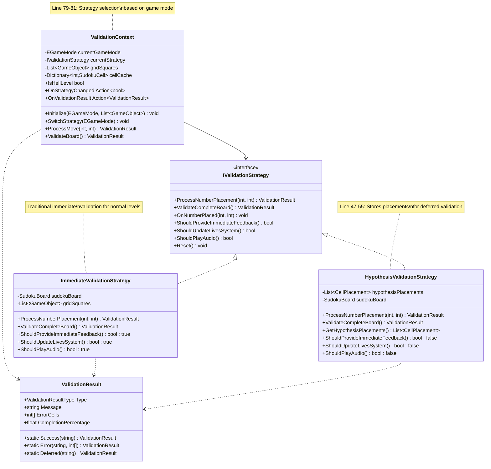
```mermaid
classDiagram
    class IValidationStrategy {
        <<interface>>
        +ProcessNumberPlacement(int, int) ValidationResult
        +ValidateCompleteBoard() ValidationResult
        +OnNumberPlaced(int, int) void
        +ShouldProvideImmediateFeedback() bool
        +ShouldUpdateLivesSystem() bool
        +ShouldPlayAudio() bool
        +Reset() void
    }
    
    class ValidationContext {
        -EGameMode currentGameMode
        -IValidationStrategy currentStrategy
        -List~GameObject~ gridSquares
        -Dictionary~int,SudokuCell~ cellCache
        +Initialize(EGameMode, List~GameObject~) void
        +SwitchStrategy(EGameMode) void
        +ProcessMove(int, int) ValidationResult
        +ValidateBoard() ValidationResult
        +IsHellLevel bool
        +OnStrategyChanged Action~bool~
        +OnValidationResult Action~ValidationResult~
    }
    
    class ImmediateValidationStrategy {
        -SudokuBoard sudokuBoard
        -List~GameObject~ gridSquares
        +ProcessNumberPlacement(int, int) ValidationResult
        +ValidateCompleteBoard() ValidationResult
        +ShouldProvideImmediateFeedback() bool : true
        +ShouldUpdateLivesSystem() bool : true
        +ShouldPlayAudio() bool : true
    }
    
    class HypothesisValidationStrategy {
        -List~CellPlacement~ hypothesisPlacements
        -SudokuBoard sudokuBoard
        +ProcessNumberPlacement(int, int) ValidationResult
        +ValidateCompleteBoard() ValidationResult
        +GetHypothesisPlacements() List~CellPlacement~
        +ShouldProvideImmediateFeedback() bool : false
        +ShouldUpdateLivesSystem() bool : false
        +ShouldPlayAudio() bool : false
    }
    
    class ValidationResult {
        +ValidationResultType Type
        +string Message
        +int[] ErrorCells
        +float CompletionPercentage
        +static Success(string) ValidationResult
        +static Error(string, int[]) ValidationResult
        +static Deferred(string) ValidationResult
    }
    
    IValidationStrategy <|.. ImmediateValidationStrategy
    IValidationStrategy <|.. HypothesisValidationStrategy
    ValidationContext --> IValidationStrategy
    ValidationContext ..> ValidationResult
    ImmediateValidationStrategy ..> ValidationResult
    HypothesisValidationStrategy ..> ValidationResult
    
    note for ValidationContext "Line 79-81: Strategy selection\nbased on game mode"
    note for HypothesisValidationStrategy "Line 47-55: Stores placements\nfor deferred validation"
    note for ImmediateValidationStrategy "Traditional immediate\nvalidation for normal levels"
```

*The Strategy Pattern is the key to this flexibility, enabling the `ValidationContext` to switch between validation behaviors without altering the core game logic. This makes the system highly modular and easy to extend.*

---

## Data Flow Analysis

### Complete Game Data Flow


```mermaid
flowchart TD
    Start([User Starts Game])
    
    Start --> MenuSelect{Select Difficulty Level}
    
    MenuSelect -->|Easy-Extreme| NormalPath[Normal Game Path]
    MenuSelect -->|Hell| HellPath[Hell Level Path]
    
    subgraph "Normal Game Flow"
        NormalPath --> SetNormalMode[MenuButtons sets GameMode<br/>Lines 17-39]
        SetNormalMode --> LoadScene[SceneManager.LoadScene<br/>Line 21,27,33,39]
        LoadScene --> InitBoard[SudokuBoard.Start<br/>Line 75]
        InitBoard --> InitValidation[InitializeValidationContext<br/>Line 88]
        InitValidation --> ImmediateStrategy[Create ImmediateValidationStrategy<br/>VC Line 50]
        ImmediateStrategy --> NormalGameplay[Normal Gameplay Loop]
        
        subgraph "Normal Gameplay"
            NormalGameplay --> CellClick[Cell Click Event<br/>OnPointerDown Line 114]
            CellClick --> SetNumber[SetSquareNumber<br/>Line 301]
            SetNumber --> ProcessImmediate[ProcessMove via ValidationContext<br/>Line 302-305]
            ProcessImmediate --> ImmediateFeedback{Correct Number?}
            ImmediateFeedback -->|Yes| SuccessFlow[Audio + Clear Notes + Check Win]
            ImmediateFeedback -->|No| ErrorFlow[Audio + Lives - 1 + Visual Error]
            SuccessFlow --> CheckComplete{Game Complete?}
            ErrorFlow --> CheckGameOver{Lives > 0?}
            CheckComplete -->|No| NormalGameplay
            CheckComplete -->|Yes| Victory[Game Won]
            CheckGameOver -->|Yes| NormalGameplay
            CheckGameOver -->|No| GameOver[Game Over]
        end
    end
    
    subgraph "Hell Level Flow"
        HellPath --> SetHellMode[MenuButtons.LoadHellScene<br/>Lines 41-45]
        SetHellMode --> LoadHellScene[SceneManager.LoadScene<br/>Line 45]
        LoadHellScene --> InitHellBoard[SudokuBoard.Start<br/>Line 75]
        InitHellBoard --> InitHellValidation[InitializeValidationContext<br/>Line 88]
        InitHellValidation --> HypothesisStrategy[Create HypothesisValidationStrategy<br/>VC Line 51]
        HypothesisStrategy --> InitHellUI[InitializeHellLevelUI<br/>Line 92]
        InitHellUI --> HellGameplay[Hell Level Gameplay]
        
        subgraph "Hell Gameplay"
            HellGameplay --> HellCellClick[Cell Click Event<br/>OnPointerDown Line 114]
            HellCellClick --> HellSetNumber[SetSquareNumber<br/>Line 301]
            HellSetNumber --> ProcessHypothesis[ProcessMove via ValidationContext<br/>Line 302-305]
            ProcessHypothesis --> StoreHypothesis[Store in hypothesis list<br/>HVS Line 47-55]
            StoreHypothesis --> OrangeStyling[Apply orange visual<br/>SC Line 310-315]
            OrangeStyling --> WaitManualValidation[Wait for Manual Validation]
            WaitManualValidation --> ManualValidate{Player clicks VALIDATE?}
            ManualValidate -->|No| HellGameplay
            ManualValidate -->|Yes| ValidateBoard[ValidateCompleteBoard<br/>HVS Line 60-108]
            ValidateBoard --> GradedFeedback[Generate graded feedback<br/>HVS Line 94]
            GradedFeedback --> ShowModal[Display ValidationResultModal]
            ShowModal --> CheckHellComplete{Perfect Solution?}
            CheckHellComplete -->|No| HellGameplay
            CheckHellComplete -->|Yes| HellVictory[Hell Level Mastered]
        end
    end
    
    Victory --> End([Game Complete])
    GameOver --> End
    HellVictory --> End
    
    classDef normalFlow fill:#e8f5e8
    classDef hellFlow fill:#fff3e0
    classDef decision fill:#e1f5fe
    classDef endpoint fill:#f3e5f5
    
    class NormalPath,SetNormalMode,LoadScene,InitBoard,InitValidation,ImmediateStrategy,NormalGameplay,CellClick,SetNumber,ProcessImmediate,SuccessFlow,ErrorFlow normalFlow
    class HellPath,SetHellMode,LoadHellScene,InitHellBoard,InitHellValidation,HypothesisStrategy,InitHellUI,HellGameplay,HellCellClick,HellSetNumber,ProcessHypothesis,StoreHypothesis,OrangeStyling,WaitManualValidation,ValidateBoard,GradedFeedback,ShowModal hellFlow
    class MenuSelect,ImmediateFeedback,CheckComplete,CheckGameOver,ManualValidate,CheckHellComplete decision
    class Start,Victory,GameOver,HellVictory,End endpoint
```

*This comprehensive data flow diagram shows the complete journey from game start to completion, highlighting the divergent paths for normal levels vs Hell Level with specific line number references.*

### ValidationContext Event Flow

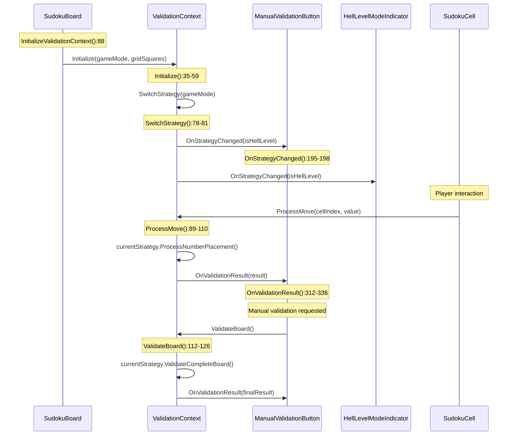
```mermaid
sequenceDiagram
    participant SB as SudokuBoard
    participant VC as ValidationContext
    participant MVB as ManualValidationButton
    participant HMI as HellLevelModeIndicator
    participant SC as SudokuCell
    
    Note over SB: InitializeValidationContext():88
    SB->>VC: Initialize(gameMode, gridSquares)
    Note over VC: Initialize():35-59
    
    VC->>VC: SwitchStrategy(gameMode)
    Note over VC: SwitchStrategy():78-81
    
    VC->>MVB: OnStrategyChanged(isHellLevel)
    Note over MVB: OnStrategyChanged():195-198
    VC->>HMI: OnStrategyChanged(isHellLevel)
    
    Note over SC: Player interaction
    SC->>VC: ProcessMove(cellIndex, value)
    Note over VC: ProcessMove():89-110
    
    VC->>VC: currentStrategy.ProcessNumberPlacement()
    VC->>MVB: OnValidationResult(result)
    Note over MVB: OnValidationResult():312-336
    
    Note over MVB: Manual validation requested
    MVB->>VC: ValidateBoard()
    Note over VC: ValidateBoard():112-126
    
    VC->>VC: currentStrategy.ValidateCompleteBoard()
    VC->>MVB: OnValidationResult(finalResult)
```

*The ValidationContext acts as a central event hub, coordinating between the game core and UI components through its event system. This event-driven approach ensures that UI elements are loosely coupled from the core game logic.*

---

## Key Integration Points

This section summarizes the most critical methods and events that connect the different systems of the game.

### Key Integration Methods and Line References

#### MenuButtons.cs Integration Points
```javascript
LoadHellScene(string name)        // Lines 41-45: Sets HELL mode and loads scene
LoadEasyScene(string name)        // Lines 17-21: Sets EASY mode and loads scene
LoadMediumScene(string name)      // Lines 23-27: Sets MEDIUM mode and loads scene
LoadHardScene(string name)        // Lines 29-33: Sets HARD mode and loads scene
LoadVeryHardScene(string name)    // Lines 35-39: Sets EXTREME mode and loads scene
newGame()                         // Lines 12-16: Resets game state flags
```

#### SudokuBoard.cs Integration Points
```javascript
Start()                           // Lines 75-103: Main initialization sequence
InitializeValidationContext()     // Lines 88-89: Sets up validation system
InitializeHellLevelUI()          // Lines 92: Creates Hell Level UI components
CreateGrid()                     // Creates 81 SudokuCell instances
setBoardPosition()               // Calculates board layout dimensions
```

#### ValidationContext.cs Integration Points
```javascript
Initialize(EGameMode, List<GameObject>)  // Lines 35-59: Complete setup
SwitchStrategy(EGameMode)                // Lines 61-87: Strategy selection
ProcessMove(int, int)                    // Lines 89-110: Cell interaction processing
ValidateBoard()                          // Lines 112-126: Manual validation trigger
OnStrategyChanged                        // Line 22: Event for UI updates
OnValidationResult                       // Line 21: Event for feedback display
```

#### SudokuCell.cs Integration Points
```javascript
OnPointerDown(PointerEventData)   // Line 114: Cell selection event
SetSquareNumber(int)             // Lines 301-305: Number placement logic
SetAsHypothesis(bool)            // Lines 594-598: Hell Level hypothesis mode
UpdateSquareColor()              // Visual state management
```

### Critical Integration Dependencies

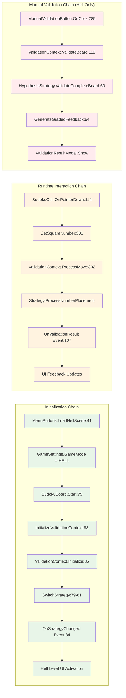
```mermaid
graph LR
    subgraph "Initialization Chain"
        A[MenuButtons.LoadHellScene:41] --> B[GameSettings.GameMode = HELL]
        B --> C[SudokuBoard.Start:75]
        C --> D[InitializeValidationContext:88]
        D --> E[ValidationContext.Initialize:35]
        E --> F[SwitchStrategy:79-81]
        F --> G[OnStrategyChanged Event:84]
        G --> H[Hell Level UI Activation]
    end
    
    subgraph "Runtime Interaction Chain"
        I[SudokuCell.OnPointerDown:114] --> J[SetSquareNumber:301]
        J --> K[ValidationContext.ProcessMove:302]
        K --> L[Strategy.ProcessNumberPlacement]
        L --> M[OnValidationResult Event:107]
        M --> N[UI Feedback Updates]
    end
    
    subgraph "Manual Validation Chain (Hell Only)"
        O[ManualValidationButton.OnClick:285] --> P[ValidationContext.ValidateBoard:112]
        P --> Q[HypothesisStrategy.ValidateCompleteBoard:60]
        Q --> R[GenerateGradedFeedback:94]
        R --> S[ValidationResultModal.Show]
    end
    
    classDef init fill:#e8f5e8
    classDef runtime fill:#fff3e0
    classDef manual fill:#ffebee
    
    class A,B,C,D,E,F,G,H init
    class I,J,K,L,M,N runtime
    class O,P,Q,R,S manual
```

*These integration chains show the critical method calls and event flows that enable the game\'s functionality across normal and Hell Level modes.*

---

## Summary

SudokuMaster implements a sophisticated dual-mode architecture that cleanly separates concerns and allows for unique gameplay experiences.

### Normal Levels (Easy-Extreme)
- **Immediate Validation**: Real-time feedback with audio and visual cues.
- **Lives System**: Error penalties leading to potential game over.
- **Assistance Features**: Hints and Fast Notes available.
- **Linear Progression**: Direct path from placement to validation.

### Hell Level Innovation
- **Hypothesis Testing**: Deferred validation allowing experimentation.
- **Manual Validation**: Player-controlled comprehensive board analysis.
- **Graded Feedback**: Nuanced progress reporting with percentage accuracy.
- **Advanced UI**: Dynamic components created specifically for Hell Level.
- **Performance Optimization**: Caching and batch processing for complex operations.

The **Strategy Pattern** is the key to this flexibility, enabling the `ValidationContext` to switch between validation behaviors without altering the core game logic. The context then serves as the central orchestrator, managing strategy selection and coordinating UI updates through its event system.

This architecture demonstrates advanced Unity development techniques including the singleton pattern, strategy pattern, event-driven architecture, and dynamic UI generation, creating a scalable and maintainable codebase that supports both traditional and innovative gameplay modes.
