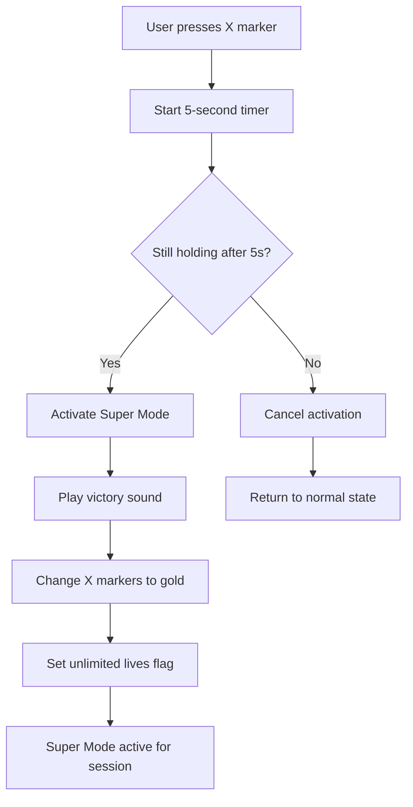
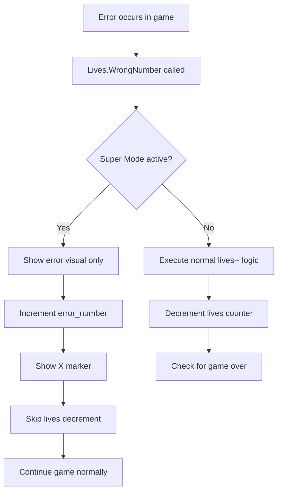

# Product Requirements Document (PRD): Super Mode Feature

## Executive Summary

This PRD defines the "Super Mode" feature for SudokuMaster - a hidden power-up mode that provides unlimited lives and enhanced visual feedback. This feature adds an easter egg element that rewards dedicated players while providing a stress-free gameplay experience.

## Current State Analysis

### Existing Lives System
- **Location**: `Assets/Scripts/Lives.cs`
- **Functionality**: Tracks player errors using three X markers in red area (top-left UI)
- **Error Limit**: 3 mistakes before game over
- **Visual Representation**: Three X images that become visible as errors accumulate
- **Game Over Logic**: Line 50 decrements lives counter, triggering game over when lives <= 0

### Current Audio System
- **Victory Audio**: `GameWon.cs` contains `Win_Audio` AudioSource
- **Gameplay Audio**: `SudokuBoard.cs` has `Correct_Audio` and `Wrong_Audio` AudioSources
- **Audio Integration**: Existing audio infrastructure ready for Super Mode sound effects

## Problem Statement

Players need a way to practice and enjoy Sudoku puzzles without the pressure of limited lives, while maintaining engagement through special achievement mechanics. The feature should be discoverable but not obvious, creating a rewarding easter egg experience.

## Requirements

### Feature 1: Super Mode Activation

**Priority**: High
**User Story**: As a player, when I hold any of the three X markers for 5 seconds, I want to unlock Super Mode so I can play without life limitations.

**Acceptance Criteria**:
- Detect long press (5 seconds) on any of the three X markers in the Lives UI
- Activation works on all three X elements regardless of their current state (visible/hidden)
- Mode persists for the current game session only
- Cannot be accidentally triggered by normal taps

### Feature 2: Super Mode Visual Feedback

**Priority**: High
**User Story**: As a player, when Super Mode activates, I want clear visual confirmation through golden X markers and victory sound so I know the mode is active.

**Acceptance Criteria**:
- Play victory sound effect (reuse existing `Win_Audio` in the WinDialog)
- Change all three X markers to gold color (RGB: 255, 215, 0 or similar gold tone)
- Maintain gold color throughout the Super Mode session
- Clear visual distinction from normal red error state

### Feature 3: Unlimited Lives Implementation

**Priority**: High
**User Story**: As a player, when Super Mode is active, I want unlimited lives so I can learn and practice without game over interruptions.

**Acceptance Criteria**:
- Bypass line 50 in `Lives.cs` (`lives--` decrement) when Super Mode is active
- Continue to show error visual feedback (X markers remain visible when errors occur)
- Maintain error counting for statistical purposes (don't break existing save/load)
- No game over popup during Super Mode
- Lives system returns to normal in subsequent games

## Detailed Technical Specifications

### Activation Flow

### Lives System Integration

## Implementation Areas

### New Components Required

**SuperModeManager.cs**:
- Singleton pattern for global access
- Long press detection on X markers (5-second threshold)
- Super Mode state management
- Integration with Lives system
- Audio playback coordination
- Visual effects management

**Modified Components**:

**Lives.cs**:
- Add Super Mode awareness in `WrongNumber()` method
- Conditional execution of `lives--` based on Super Mode state
- Maintain error tracking for statistics
- Preserve save/load functionality

**UI Integration**:
- Add long press gesture recognizers to X marker GameObjects
- Implement gold color state for X markers

### Integration Points

1. **Lives System Hook**: Modify `WrongNumber()` method to check Super Mode state
2. **Audio System**: Utilize existing `Win_Audio` or create dedicated Super Mode audio
3. **UI System**: Enhance X marker GameObjects with interaction capabilities
4. **State Management**: Coordinate with existing `GameSettings` and `Config` systems
5. **Session Management**: Reset Super Mode state between games

## Success Metrics

### User Experience
- **Discoverability**: Easter egg should be findable by curious players
- **Activation Feedback**: Clear confirmation that mode is active
- **Stress-Free Gameplay**: No interruptions from game over during Super Mode
- **Visual Appeal**: Attractive gold visual state enhances premium feel

### Technical Performance
- **Gesture Recognition**: Accurate 5-second hold detection without false positives
- **Audio Integration**: Smooth sound playback without conflicts
- **State Management**: Reliable mode activation/deactivation
- **Compatibility**: No interference with existing save/load or progression systems

## Testing Requirements

### Unit Tests
- Super Mode activation/deactivation logic
- Lives system bypass functionality
- Audio playback triggers
- Visual state transitions

### Integration Tests
- Long press gesture recognition on all three X markers
- Lives system integration with Super Mode active/inactive
- Game session state management
- Save/load compatibility

### UI Tests
- Visual feedback during 5-second hold
- Gold color state rendering
- X marker interaction responsiveness
- Audio-visual synchronization

## User Interface Specifications

### X Marker States
1. **Normal State**: Default red X appearance when errors occur
2. **Super Mode Activation**: Visual feedback during 5-second hold (scaling, opacity, or color shift)
3. **Super Mode Active**: Gold color (RGB: 255, 215, 0) with optional glow effect
4. **Error in Super Mode**: Gold X becomes visible but lives don't decrease

### Visual Design Guidelines
- **Gold Color**: Premium, celebratory appearance
- **Activation Feedback**: Subtle but clear progress indication
- **Consistency**: Maintain existing UI proportions and positioning
- **Accessibility**: Ensure sufficient contrast for visibility

## Technical Risk Assessment

### Implementation Risks
- **Gesture Conflicts**: Long press detection interfering with normal UI interactions
- **Audio Conflicts**: Victory sound overlapping with existing game audio
- **State Persistence**: Ensuring Super Mode doesn't accidentally persist between sessions
- **Performance Impact**: Additional gesture detection overhead

### Mitigation Strategies
- **Precise Gesture Recognition**: Implement robust long press detection with appropriate thresholds
- **Audio Management**: Coordinate with existing audio system and respect volume settings
- **Session Isolation**: Clear Super Mode state on game end/restart
- **Optimization**: Minimal performance impact through efficient event handling

## Implementation Priority

1. **Phase 1**: Core Super Mode Manager and Lives system integration
2. **Phase 2**: Long press detection and activation mechanics
3. **Phase 3**: Visual feedback and gold color implementation
4. **Phase 4**: Audio integration and polish effects

## Success Definition

The Super Mode feature is successful when:
- Players can discover and activate the mode through intuitive long press gesture
- Mode provides clear visual and audio confirmation
- Unlimited lives functionality works reliably without breaking existing systems
- Feature enhances player enjoyment without compromising core gameplay balance
- Implementation is robust and maintains performance standards

## Future Considerations

### Potential Enhancements
- **Super Mode Achievements**: Track usage statistics
- **Enhanced Visual Effects**: Particle effects, animations
- **Progression Integration**: Special rewards for Super Mode usage
- **Accessibility Options**: Alternative activation methods for users with motor difficulties

### Analytics Integration
- Track Super Mode discovery rate
- Monitor usage patterns and session duration
- Measure impact on player retention and engagement
- Evaluate feature adoption across different skill levels